# PRD Dependency DAG (Directed Acyclic Graph)

> **Generated**: 2026-01-10
> **Total PRDs**: 44
> **Total Stories**: ~380
> **Execution Phases**: 6

---

## Overview

This document visualizes the complete dependency graph of all PRDs in the Renoz v3 evolution. The graph is a valid DAG (no cycles) ensuring predictable execution order.

---

## Master DAG Visualization

```mermaid
flowchart TD
    subgraph Phase1["Phase 1: REFACTORING"]
        REF-SERVER["REF-SERVER<br/>Server Patterns<br/>8 stories"]
        REF-COMPONENTS["REF-COMPONENTS<br/>Component Extraction<br/>8 stories"]
        REF-HOOKS["REF-HOOKS<br/>Hook Organization<br/>8 stories"]
        REF-AI["REF-AI<br/>AI Architecture<br/>8 stories"]
    end

    subgraph Phase2["Phase 2: FOUNDATION"]
        FOUND-SCHEMA["FOUND-SCHEMA<br/>Schema Foundation<br/>8 stories"]
        FOUND-AUTH["FOUND-AUTH<br/>Auth & Permissions<br/>8 stories"]
        FOUND-APPSHELL["FOUND-APPSHELL<br/>App Shell<br/>8 stories"]
        FOUND-SHARED["FOUND-SHARED<br/>Shared Components<br/>8 stories"]
    end

    subgraph Phase25["Phase 2.5: EARLY ROLE"]
        ROLE-ADMIN["ROLE-ADMIN<br/>Admin Dashboard<br/>8 stories"]
    end

    subgraph Phase3["Phase 3: CROSS-CUTTING"]
        CC-ERROR["CC-ERROR<br/>Error Handling<br/>8 stories"]
        CC-LOADING["CC-LOADING<br/>Loading States<br/>8 stories"]
        CC-EMPTY["CC-EMPTY<br/>Empty States<br/>8 stories"]
        CC-NOTIFY["CC-NOTIFY<br/>Notifications<br/>8 stories"]
        CC-A11Y["CC-A11Y<br/>Accessibility<br/>8 stories"]
    end

    subgraph Phase4["Phase 4: DOMAINS"]
        subgraph TrackA["Track A: Product Line"]
            DOM-PROD["DOM-PRODUCTS<br/>Product Catalog<br/>15 stories"]
            DOM-INV["DOM-INVENTORY<br/>Stock Management<br/>12 stories"]
            DOM-SUPP["DOM-SUPPLIERS<br/>Supplier Mgmt<br/>10 stories"]
        end
        subgraph TrackB["Track B: Service Line"]
            DOM-JOBS["DOM-JOBS<br/>Field Service<br/>15 stories"]
            DOM-SUPPORT["DOM-SUPPORT<br/>Tickets/Issues<br/>12 stories"]
            DOM-WARRANTY["DOM-WARRANTY<br/>Warranty Mgmt<br/>10 stories"]
        end
        subgraph TrackC["Track C: Analytics"]
            DOM-FIN["DOM-FINANCIAL<br/>Invoicing/Payments<br/>15 stories"]
            DOM-DASH["DOM-DASHBOARD<br/>KPI Dashboard<br/>12 stories"]
        end
        subgraph TrackD["Track D: Independent"]
            DOM-COMMS["DOM-COMMUNICATIONS<br/>Email/SMS<br/>12 stories"]
        end
        subgraph Complete["Already Complete"]
            DOM-CUST["DOM-CUSTOMERS<br/>Customer Mgmt<br/>17 stories ✅"]
            DOM-ORD["DOM-ORDERS<br/>Order Processing<br/>19 stories ✅"]
            DOM-PIPE["DOM-PIPELINE<br/>Sales Pipeline<br/>16 stories ✅"]
        end
    end

    subgraph Phase5["Phase 5: INTEGRATIONS + ROLES"]
        subgraph Integrations["Integrations"]
            INT-XERO["INT-XERO<br/>Accounting Sync<br/>12 stories"]
            INT-RESEND["INT-RESEND<br/>Email Service<br/>10 stories"]
            INT-CLAUDE["INT-CLAUDE<br/>AI Assistant<br/>12 stories"]
        end
        subgraph Roles["Roles"]
            ROLE-SALES["ROLE-SALES<br/>Sales Dashboard<br/>8 stories"]
            ROLE-OPS["ROLE-OPS<br/>Operations<br/>8 stories"]
            ROLE-WAREHOUSE["ROLE-WAREHOUSE<br/>Warehouse<br/>8 stories"]
            ROLE-PORTAL["ROLE-PORTAL<br/>Customer Portal<br/>10 stories"]
        end
    end

    subgraph Phase6["Phase 6: WORKFLOWS"]
        subgraph SalesPipeline["Sales Pipeline"]
            WF-LTO["WF-LTO<br/>Lead to Opportunity<br/>8 stories"]
            WF-OTQ["WF-OTQ<br/>Opportunity to Quote<br/>8 stories"]
            WF-QTO["WF-QTO<br/>Quote to Order<br/>10 stories"]
            WF-FULFILL["WF-FULFILL<br/>Fulfillment<br/>10 stories"]
        end
        subgraph ServicePipeline["Service Pipeline"]
            WF-ISSUE["WF-ISSUE<br/>Issue Resolution<br/>8 stories"]
            WF-WARRANTY-WF["WF-WARRANTY<br/>Warranty Process<br/>8 stories"]
        end
        subgraph SupplyPipeline["Supply Pipeline"]
            WF-SUPPLIER["WF-SUPPLIER<br/>Procurement<br/>8 stories"]
            WF-FIN["WF-FINANCIAL<br/>Reconciliation<br/>10 stories"]
        end
    end

    %% Phase 1 Dependencies
    REF-SERVER --> REF-COMPONENTS
    REF-SERVER --> REF-HOOKS
    REF-SERVER --> REF-AI

    %% Phase 1 -> Phase 2
    REF-SERVER --> FOUND-SCHEMA

    %% Phase 2 Internal
    FOUND-SCHEMA --> FOUND-AUTH
    FOUND-AUTH --> FOUND-APPSHELL
    FOUND-AUTH --> FOUND-SHARED

    %% Phase 2 -> Phase 2.5
    FOUND-AUTH --> ROLE-ADMIN

    %% Phase 2 -> Phase 3
    FOUND-AUTH --> CC-ERROR
    CC-ERROR --> CC-LOADING
    CC-ERROR --> CC-EMPTY
    CC-ERROR --> CC-NOTIFY

    %% Phase 3 -> Phase 4 (Track A)
    CC-ERROR --> DOM-PROD
    DOM-PROD --> DOM-INV
    DOM-INV --> DOM-SUPP

    %% Phase 3 -> Phase 4 (Track B)
    DOM-ORD --> DOM-JOBS
    DOM-JOBS --> DOM-SUPPORT
    DOM-CUST --> DOM-SUPPORT
    DOM-SUPPORT --> DOM-WARRANTY
    DOM-PROD --> DOM-WARRANTY

    %% Phase 3 -> Phase 4 (Track C)
    DOM-ORD --> DOM-FIN
    DOM-PROD --> DOM-FIN
    DOM-FIN --> DOM-DASH

    %% Phase 3 -> Phase 4 (Track D)
    DOM-CUST --> DOM-COMMS

    %% Phase 4 -> Phase 5 (Integrations)
    DOM-FIN --> INT-XERO
    DOM-ORD --> INT-XERO
    DOM-COMMS --> INT-RESEND
    DOM-CUST --> INT-RESEND
    REF-AI --> INT-CLAUDE

    %% Phase 4 -> Phase 5 (Roles)
    ROLE-ADMIN --> ROLE-SALES
    DOM-PIPE --> ROLE-SALES
    ROLE-SALES --> ROLE-OPS
    DOM-ORD --> ROLE-OPS
    ROLE-OPS --> ROLE-WAREHOUSE
    DOM-INV --> ROLE-WAREHOUSE
    ROLE-WAREHOUSE --> ROLE-PORTAL
    DOM-CUST --> ROLE-PORTAL

    %% Phase 5 -> Phase 6 (Sales Pipeline)
    DOM-CUST --> WF-LTO
    DOM-PIPE --> WF-LTO
    WF-LTO --> WF-OTQ
    DOM-PIPE --> WF-OTQ
    WF-OTQ --> WF-QTO
    DOM-ORD --> WF-QTO
    WF-QTO --> WF-FULFILL
    DOM-INV --> WF-FULFILL

    %% Phase 5 -> Phase 6 (Service Pipeline)
    DOM-SUPPORT --> WF-ISSUE
    DOM-CUST --> WF-ISSUE
    WF-ISSUE --> WF-WARRANTY-WF
    DOM-WARRANTY --> WF-WARRANTY-WF

    %% Phase 5 -> Phase 6 (Supply Pipeline)
    DOM-SUPP --> WF-SUPPLIER
    DOM-INV --> WF-SUPPLIER
    WF-SUPPLIER --> WF-FIN
    DOM-FIN --> WF-FIN
    INT-XERO --> WF-FIN

    %% Styling
    classDef complete fill:#90EE90,stroke:#228B22
    classDef critical fill:#FFB6C1,stroke:#DC143C
    classDef blocking fill:#FFD700,stroke:#DAA520
    classDef parallel fill:#87CEEB,stroke:#4682B4

    class DOM-CUST,DOM-ORD,DOM-PIPE complete
    class REF-SERVER,FOUND-SCHEMA,FOUND-AUTH,CC-ERROR blocking
    class DOM-FIN,DOM-JOBS,DOM-PROD critical
```



---

## Phase Dependency Matrix

### Phase 1: REFACTORING (Must Start)

| PRD | Depends On | Enables |
|-----|------------|---------|
| REF-SERVER | None (Entry Point) | REF-COMPONENTS, REF-HOOKS, REF-AI, FOUND-SCHEMA |
| REF-COMPONENTS | REF-SERVER | All UI PRDs |
| REF-HOOKS | REF-SERVER | All feature PRDs |
| REF-AI | REF-SERVER | INT-CLAUDE |

**Blocking Path**: REF-SERVER must complete before anything else

---

### Phase 2: FOUNDATION

| PRD | Depends On | Enables |
|-----|------------|---------|
| FOUND-SCHEMA | REF-SERVER | FOUND-AUTH, All domain schemas |
| FOUND-AUTH | FOUND-SCHEMA | FOUND-APPSHELL, FOUND-SHARED, ROLE-ADMIN, CC-ERROR |
| FOUND-APPSHELL | FOUND-AUTH | All UI routes |
| FOUND-SHARED | FOUND-AUTH | All UI components |

**Blocking Path**: FOUND-SCHEMA → FOUND-AUTH

---

### Phase 2.5: EARLY ROLE

| PRD | Depends On | Enables |
|-----|------------|---------|
| ROLE-ADMIN | FOUND-AUTH | ROLE-SALES, Testing infrastructure |

**Purpose**: Enable QA testing of all subsequent work

---

### Phase 3: CROSS-CUTTING

| PRD | Depends On | Enables |
|-----|------------|---------|
| CC-ERROR | FOUND-AUTH | CC-LOADING, CC-EMPTY, CC-NOTIFY, All domains |
| CC-LOADING | CC-ERROR | All UI with loading states |
| CC-EMPTY | CC-ERROR | All UI with empty states |
| CC-NOTIFY | CC-ERROR | All notification features |
| CC-A11Y | None (Continuous) | Accessibility compliance |

**Blocking Path**: CC-ERROR must complete first

---

### Phase 4: DOMAINS (4 Parallel Tracks)

#### Track A: Product Line
| PRD | Depends On | Enables |
|-----|------------|---------|
| DOM-PRODUCTS | CC-ERROR | DOM-INVENTORY, DOM-FINANCIAL, DOM-WARRANTY |
| DOM-INVENTORY | DOM-PRODUCTS | DOM-SUPPLIERS, ROLE-WAREHOUSE, WF-FULFILL |
| DOM-SUPPLIERS | DOM-INVENTORY | WF-SUPPLIER |

#### Track B: Service Line
| PRD | Depends On | Enables |
|-----|------------|---------|
| DOM-JOBS | DOM-ORDERS ✅ | DOM-SUPPORT |
| DOM-SUPPORT | DOM-JOBS, DOM-CUSTOMERS ✅ | DOM-WARRANTY, WF-ISSUE |
| DOM-WARRANTY | DOM-SUPPORT, DOM-PRODUCTS | WF-WARRANTY |

#### Track C: Analytics
| PRD | Depends On | Enables |
|-----|------------|---------|
| DOM-FINANCIAL | DOM-ORDERS ✅, DOM-PRODUCTS | DOM-DASHBOARD, INT-XERO, WF-FINANCIAL |
| DOM-DASHBOARD | DOM-FINANCIAL | Business intelligence |

#### Track D: Independent
| PRD | Depends On | Enables |
|-----|------------|---------|
| DOM-COMMUNICATIONS | DOM-CUSTOMERS ✅ | INT-RESEND |

#### Already Complete (Entry Points for Phase 4)
| PRD | Status | Enables |
|-----|--------|---------|
| DOM-CUSTOMERS | ✅ 17 stories | DOM-SUPPORT, DOM-COMMS, INT-RESEND, WF-LTO, WF-ISSUE, ROLE-PORTAL |
| DOM-ORDERS | ✅ 19 stories | DOM-JOBS, DOM-FINANCIAL, INT-XERO, WF-QTO, ROLE-OPS |
| DOM-PIPELINE | ✅ 16 stories | ROLE-SALES, WF-LTO, WF-OTQ |

---

### Phase 5: INTEGRATIONS + ROLES

#### Integrations Track
| PRD | Depends On | Enables |
|-----|------------|---------|
| INT-XERO | DOM-FINANCIAL, DOM-ORDERS | WF-FINANCIAL |
| INT-RESEND | DOM-COMMUNICATIONS, DOM-CUSTOMERS | Email automation |
| INT-CLAUDE | REF-AI | AI-assisted features |

#### Roles Track (Sequential)
| PRD | Depends On | Enables |
|-----|------------|---------|
| ROLE-SALES | ROLE-ADMIN, DOM-PIPELINE | ROLE-OPS |
| ROLE-OPS | ROLE-SALES, DOM-ORDERS | ROLE-WAREHOUSE |
| ROLE-WAREHOUSE | ROLE-OPS, DOM-INVENTORY | ROLE-PORTAL |
| ROLE-PORTAL | ROLE-WAREHOUSE, DOM-CUSTOMERS | External customer access |

---

### Phase 6: WORKFLOWS (3 Parallel Pipelines)

#### Sales Pipeline (Sequential)
| PRD | Depends On | Enables |
|-----|------------|---------|
| WF-LTO | DOM-CUSTOMERS, DOM-PIPELINE | WF-OTQ |
| WF-OTQ | WF-LTO, DOM-PIPELINE | WF-QTO |
| WF-QTO | WF-OTQ, DOM-ORDERS | WF-FULFILL |
| WF-FULFILL | WF-QTO, DOM-INVENTORY | Complete sales cycle |

#### Service Pipeline (Sequential)
| PRD | Depends On | Enables |
|-----|------------|---------|
| WF-ISSUE | DOM-SUPPORT, DOM-CUSTOMERS | WF-WARRANTY |
| WF-WARRANTY | WF-ISSUE, DOM-WARRANTY | Complete service cycle |

#### Supply Pipeline (Sequential)
| PRD | Depends On | Enables |
|-----|------------|---------|
| WF-SUPPLIER | DOM-SUPPLIERS, DOM-INVENTORY | WF-FINANCIAL |
| WF-FINANCIAL | WF-SUPPLIER, DOM-FINANCIAL, INT-XERO | Complete procurement cycle |

---

## Critical Paths

### Longest Path (Sales Workflow)
```
REF-SERVER → FOUND-SCHEMA → FOUND-AUTH → CC-ERROR → DOM-PRODUCTS →
DOM-INVENTORY → WF-FULFILL
```
**Length**: 7 PRDs deep

### Longest Path (Financial Reconciliation)
```
REF-SERVER → FOUND-SCHEMA → FOUND-AUTH → CC-ERROR → DOM-PRODUCTS →
DOM-FINANCIAL → INT-XERO → WF-FINANCIAL
```
**Length**: 8 PRDs deep (longest overall)

### Parallel Opportunities

| Week Range | Parallel PRDs | Max Concurrency |
|------------|---------------|-----------------|
| 1-2 | REF-COMPONENTS, REF-HOOKS, REF-AI | 3 |
| 3-4 | FOUND-APPSHELL, FOUND-SHARED, ROLE-ADMIN | 3 |
| 4-6 | CC-LOADING, CC-EMPTY, CC-NOTIFY | 3 |
| 6-10 | Track A, B, C, D (all 4 domain tracks) | 4 |
| 10-12 | Integrations (3) + Roles (4) | 5 |
| 12-14 | Sales, Service, Supply pipelines | 3 |

---

## DAG Validation

### Cycle Check

The graph has been validated for cycles. No cycles exist.

**Validation Method**:
1. Topological sort succeeds
2. All edges point "forward" in phase order
3. No self-references
4. No mutual dependencies between PRDs

### Entry Points (No Dependencies)

| PRD | Phase | Can Start Immediately |
|-----|-------|----------------------|
| REF-SERVER | 1 | Yes |
| CC-A11Y | 3 | Yes (continuous) |
| DOM-CUSTOMERS | 4 | Yes (complete) |
| DOM-ORDERS | 4 | Yes (complete) |
| DOM-PIPELINE | 4 | Yes (complete) |

### Exit Points (Nothing Depends On)

| PRD | Phase | Final Deliverable |
|-----|-------|-------------------|
| WF-FULFILL | 6 | Complete sales fulfillment |
| WF-WARRANTY | 6 | Complete warranty processing |
| WF-FINANCIAL | 6 | Complete financial reconciliation |
| ROLE-PORTAL | 5 | External customer access |
| DOM-DASHBOARD | 4 | Business intelligence |

---

## Story-Level DAG

For story-level dependencies within each PRD, see:
- [Critical Path Analysis](./critical-path.md)
- [Execution Sequence](./execution-sequence.md)

### Story Naming Convention

```
DOM-{DOMAIN}-{NNN}{suffix}
    │        │     │
    │        │     └── a=schema, b=server, c=UI
    │        └── Story number (001-999)
    └── Domain abbreviation
```

**Valid dependency flows**:
- `XXX-001a → XXX-001b → XXX-001c` (within story)
- `XXX-001c → XXX-007a` (cross-story, same PRD)
- Never across PRDs (use PRD-level dependencies)

---

## Quick Reference

### Blocking PRDs (Must Complete First)
1. **REF-SERVER** - All server patterns
2. **FOUND-SCHEMA** - All schema patterns
3. **FOUND-AUTH** - All permission checks
4. **CC-ERROR** - All error handling

### Already Complete (Free Entry Points)
1. **DOM-CUSTOMERS** - 17 stories ✅
2. **DOM-ORDERS** - 19 stories ✅
3. **DOM-PIPELINE** - 16 stories ✅

### High-Value Parallel Opportunities
1. Phase 4 Domain Tracks (4 parallel)
2. Phase 5 Integrations (3 parallel)
3. Phase 6 Workflow Pipelines (3 parallel)

---

## Related Documents

- [Execution Sequence](./execution-sequence.md) - Detailed sprint plan
- [Critical Path Analysis](./critical-path.md) - Story-level dependencies
- [UX Debt Mapping](./ux-debt-to-prd-mapping.md) - Gap analysis
- [Wireframe Readiness Matrix](../_wireframes/wireframe-readiness-matrix.md)
