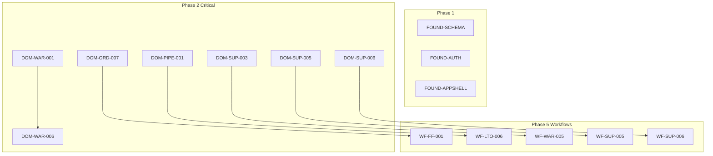

# Master Execution Plan

Generated: 2026-01-09
Based on: 44 PRD Audit Files

---

## Phase Overview

| Phase | Focus | PRD Count | Est. Iterations | Duration |
|-------|-------|-----------|-----------------|----------|
| 0 | Quick Wins & Cleanup | N/A | 24 | 1 week |
| 1 | Foundation | 4 | 28 | 2 weeks |
| 2 | Core Domains | 8 | 187 | 6 weeks |
| 3 | Extended Domains | 9 | 225 | 7 weeks |
| 4 | Roles & Integrations | 8 | 178 | 6 weeks |
| 5 | Workflows | 7 | 198 | 6 weeks |
| 6 | Cross-Cutting Polish | 6 | 33 | 2 weeks |

**Total Estimated Iterations: 873**
**Total Duration: ~30 weeks** (with 3 parallel tracks)

---

## Phase 0: Quick Wins & Cleanup (Week 1)

Execute immediately - high value, low effort.

### Invalid Stories to Remove from PRDs

Mark these as `status: "implemented"` - no work needed:

```
Foundation:
- FOUND-AUTH-003 (Auth README exists)
- FOUND-SHARED-001 (Wrapper pattern correct)

Domains:
- DOM-DASH-001 (Widget customization exists)
- DOM-JOBS-006 (Mobile job view exists)
- DOM-PROD-005 (Bulk import exists)
- DOM-RPT-001-003, 008 (Reports exist)
- DOM-USER-004 (Profile photos exist - reduce to crop only)

Roles:
- ROLE-FIELD-002 (PWA implemented)
- ROLE-SALES-002 (Global search exists)

Integrations:
- INT-AI-002, 003 (Page context, suggestions exist)

Workflows:
- WF-FF-002, 003, 005 (90%+ complete - reduce scope)
- WF-PROC-005 (Goods receipt complete)

Cross-Cutting:
- CC-A11Y-001-004 (Accessibility implemented)
- CC-EMPTY-001-004 (Empty states implemented)
- CC-ERR-001-006, 008 (Error handling implemented)
- CC-LOAD-001-003 (Loading states implemented)
- CC-NOTIFY-001-006 (Notifications implemented)
```

### Quick Win Stories (1-2 iterations each)

| Story | Name | Iterations | Track |
|-------|------|------------|-------|
| DOM-WAR-002a | Complete Auto-Registration Notifications | 2 | A |
| DOM-SUPP-001 | Supplier Performance (reduced) | 2 | A |
| WF-FF-002 | Auto Stock Allocation Trigger | 1 | B |
| WF-FF-003 | Pick Lists Polish | 1 | B |
| WF-FF-005 | Shipping Workflow Polish | 1 | B |
| DOM-SUPP-003 | Auto-PO Suggestions UI | 2 | C |
| DOM-SUPP-004 | Partial Receipt History | 2 | C |
| FOUND-SCHEMA-001 | Schema Documentation | 2 | C |

**Track A**: Warranty/Supplier focus
**Track B**: Order Fulfillment focus
**Track C**: Procurement/Foundation focus

---

## Phase 1: Foundation (Weeks 2-3)

Foundation PRDs must complete before dependent domains.

### Dependency Order

```
FOUND-SCHEMA (no deps)
    └── FOUND-AUTH-005 (schema patterns)

FOUND-APPSHELL (no deps)
    └── All domain UIs depend on shell

FOUND-SHARED (no deps)
    └── All components use shared
```

### Stories

| Story | Name | Iterations | Dependencies |
|-------|------|------------|--------------|
| FOUND-SCHEMA-003 | Validation Schema Sync | 3 | None |
| FOUND-SCHEMA-005 | Schema Migration Tooling | 4 | FOUND-SCHEMA-003 |
| FOUND-AUTH-005 | Session Activity Tracking | 5 | None |
| FOUND-APPSHELL-* | All valid | 8 | None |
| FOUND-SHARED-002 | Breadcrumb Cleanup | 2 | None |

---

## Phase 2: Core Domains (Weeks 4-9)

Core business domains that block other work.

### Domain Priority Order

```
1. Orders (63% implemented) - blocks fulfillment workflows
2. Inventory (partial) - blocks procurement workflows
3. Pipeline (45% implemented) - blocks lead-to-order workflow
4. Customers (mostly complete) - blocks onboarding workflow
5. Products - blocks warranty workflows
6. Support - blocks warranty claims workflow
7. Financial - blocks invoicing workflow
8. Jobs - independent track
```

### Parallel Tracks

**Track A: Sales/CRM**
```
DOM-PIPE (pipeline)
└── DOM-PIPE-001 (forecasting) - blocks WF-LTO-006
└── DOM-PIPE-002 (quote PDF)
└── DOM-PIPE-003-008 (remaining pipeline stories)
```

**Track B: Operations**
```
DOM-ORD (orders)
└── DOM-ORD-007 (fulfillment dashboard) - blocks WF-FF-001
└── DOM-ORD-001 (shipment tracking)
└── DOM-ORD-002-006 (remaining orders)

DOM-INV (inventory)
└── DOM-INV-001 (stock valuation)
└── DOM-INV-002 (warehouse locations) - enhances pick lists
└── DOM-INV-004 (reserved stock) - enhances allocation
```

**Track C: Support/Warranty**
```
DOM-SUP (support)
└── DOM-SUP-001 (SLA tracking) - blocks WF-SUP-006
└── DOM-SUP-003 (RMA workflow) - CRITICAL: blocks WF-WAR-005
└── DOM-SUP-004-006 (remaining support)

DOM-WAR (warranty)
└── DOM-WAR-001 (warranty policies) - blocks DOM-WAR-004, 007
└── DOM-WAR-006 (claim workflow) - blocks WF-WAR-*
└── DOM-WAR-003-008 (remaining warranty)
```

### Critical Path Items

| Story | Name | Blocks | Iterations |
|-------|------|--------|------------|
| DOM-ORD-007 | Fulfillment Dashboard | WF-FF-001 | 5 |
| DOM-PIPE-001 | Sales Forecasting | WF-LTO-006 | 6 |
| DOM-SUP-003 | RMA Workflow | WF-WAR-005 | 6 |
| DOM-SUP-005 | Customer Satisfaction | WF-SUP-005 | 5 |
| DOM-SUP-006 | Support Dashboard | WF-SUP-006 | 5 |
| DOM-WAR-001 | Warranty Policies | DOM-WAR-004, 007 | 12 |

---

## Phase 3: Extended Domains (Weeks 10-16)

Domains that enhance but don't block critical workflows.

### Parallel Tracks

**Track A: Administration**
```
DOM-USER
└── DOM-USER-002 (groups/teams)
└── DOM-USER-003 (delegation)
└── DOM-USER-007 (onboarding checklist)

DOM-SET (settings)
└── DOM-SET-001 (data export)
└── DOM-SET-003 (scheduled maintenance)
└── DOM-SET-005 (SLA configuration)
└── DOM-SET-006 (custom fields)
```

**Track B: Analytics**
```
DOM-DASH
└── DOM-DASH-002 (cross-filtering)
└── DOM-DASH-003 (drill-down)
└── DOM-DASH-004 (anomaly detection)
└── DOM-DASH-008 (mobile dashboard)

DOM-RPT
└── DOM-RPT-005 (scheduled reports)
└── DOM-RPT-006 (report favorites)
```

**Track C: Communications**
```
DOM-COMMS
└── DOM-COMMS-001 (email tracking)
└── DOM-COMMS-002 (SMS integration)
└── DOM-COMMS-003 (call logging)
└── DOM-COMMS-004 (unified inbox)
```

---

## Phase 4: Roles & Integrations (Weeks 17-22)

Role-specific views and external integrations.

### Parallel Tracks

**Track A: Roles**
```
ROLE-ADMIN
└── 7 stories, 38 iterations total

ROLE-FINANCE
└── 6 stories, 34 iterations total

ROLE-OPS
└── 7 stories, 28 iterations total

ROLE-SALES
└── 5 stories, 26 iterations total (2 reduced scope)

ROLE-FIELD
└── 6 stories, most reduced scope
```

**Track B: Integrations**
```
INT-XERO (complete partial implementations)
└── INT-XERO-001 (contact pull)
└── INT-XERO-002 (auto invoice)
└── INT-XERO-005 (error UI)
└── INT-XERO-006 (sync history)
└── INT-XERO-003 (credit notes) - depends on DOM-FIN-001

INT-RES (Resend)
└── INT-RES-001-007

INT-AI (Claude)
└── INT-AI-004 (contextual actions)
└── INT-AI-005 (learning loop)
```

---

## Phase 5: Workflows (Weeks 23-28)

Cross-domain orchestration workflows.

### Dependency Order

```
WF-ONBOARDING (depends on DOM-CUST, DOM-USER)
WF-LTO (depends on DOM-PIPE, DOM-ORD)
WF-FF (depends on DOM-ORD, DOM-INV)
WF-PROC (depends on DOM-SUPP, DOM-INV)
WF-INV (depends on DOM-ORD, DOM-FIN)
WF-SUP (depends on DOM-SUP)
WF-WAR (depends on DOM-WAR, DOM-SUP-003)
```

### Parallel Tracks

**Track A: Sales Workflows**
```
WF-LTO (Lead to Order)
└── WF-LTO-001 (guided wizard) - 7 iterations
└── WF-LTO-002 (approval tracking) - 4 iterations
└── WF-LTO-003 (follow-up sequences) - 6 iterations
└── WF-LTO-004 (one-click conversion) - 4 iterations
└── WF-LTO-005 (analytics) - 5 iterations
└── WF-LTO-006 (win probability) - BLOCKED by DOM-PIPE-001

WF-ONBOARDING
└── All 6 stories - 36 iterations total
```

**Track B: Operations Workflows**
```
WF-FF (Order Fulfillment)
└── WF-FF-001 (fulfillment queue) - 4 iterations (reduced)
└── WF-FF-004 (packing workflow) - 2 iterations (reduced)
└── WF-FF-006 (fulfillment metrics) - 4 iterations

WF-PROC (Procurement)
└── WF-PROC-001-004 - 22 iterations total

WF-INV (Invoicing)
└── WF-INV-001-006 - 24 iterations total
```

**Track C: Support Workflows**
```
WF-SUP (Support Resolution)
└── 10 atomic stories - 25 iterations total
└── WF-SUP-005, 006 BLOCKED by DOM-SUP-005, 006

WF-WAR (Warranty Claims)
└── 16+ atomic stories - 63 iterations total
└── WF-WAR-005 BLOCKED by DOM-SUP-003
```

---

## Phase 6: Cross-Cutting Polish (Weeks 29-30)

Final polish and enhancements.

### Stories

| PRD | Remaining Stories | Iterations |
|-----|-------------------|------------|
| CC-A11Y | 005-008 | 9 |
| CC-EMPTY | 005-006 | 5 |
| CC-ERR | 007, new 009 | 6 |
| CC-LOAD | 004-007 | 9 |
| CC-NOTIFY | 007-008 | 6 |
| CC-COMPONENTS | 300+ line refactoring | 10 |

---

## Dependency DAG (Directed Acyclic Graph)

### Critical Blockers



### Domain Dependencies

```
Orders Domain:
  DOM-ORD-007 → WF-FF-001 (Fulfillment Queue)

Pipeline Domain:
  DOM-PIPE-001 → WF-LTO-006 (Win Probability)
  DOM-PIPE-002 → All quote PDF features

Support Domain:
  DOM-SUP-003 → WF-WAR-005 (Product Returns) **HARD BLOCKER**
  DOM-SUP-004 → WF-SUP-001b (Triage Checklist)
  DOM-SUP-005 → WF-SUP-005 (Post-Resolution Feedback) **HARD BLOCKER**
  DOM-SUP-006 → WF-SUP-006 (Workflow Metrics) **HARD BLOCKER**

Warranty Domain:
  DOM-WAR-001 → DOM-WAR-004 (Certificates)
  DOM-WAR-001 → DOM-WAR-007 (Extensions)
  DOM-WAR-006 → DOM-WAR-008 (Analytics)
  DOM-WAR-006 → WF-WAR-* (All claim workflow stories)

Financial Domain:
  DOM-FIN-001 → INT-XERO-003 (Credit Note Sync)

User Domain:
  DOM-USER-002 → DOM-USER-006b (Bulk Add to Group)
  DOM-USER-004 → DOM-USER-007c (Onboarding Profile Step)
```

---

## Blocked Stories

| Story | Blocked By | Severity | Mitigation |
|-------|------------|----------|------------|
| WF-LTO-006 | DOM-PIPE-001 | Medium | Defer until Phase 2 |
| WF-SUP-005 | DOM-SUP-005 | Hard | Cannot proceed |
| WF-SUP-006 | DOM-SUP-006 | Hard (UI) | Server work can parallel |
| WF-WAR-005 | DOM-SUP-003 | Hard | Cannot proceed OR simplified return tracking |
| INT-XERO-003 | DOM-FIN-001 | Hard | Credit notes need schema first |
| DOM-USER-007c | DOM-USER-004 | Soft | Profile step needs avatar crop |

### Recommended Unblock Order

1. **DOM-SUP-003 (RMA)** - Unblocks WF-WAR-005 (product returns)
2. **DOM-SUP-005 (CSAT)** - Unblocks WF-SUP-005 (feedback)
3. **DOM-SUP-006 (Dashboard)** - Unblocks WF-SUP-006 (metrics)
4. **DOM-PIPE-001 (Forecasting)** - Unblocks WF-LTO-006 (probability)
5. **DOM-FIN-001 (Credit Notes)** - Unblocks INT-XERO-003

---

## Parallel Track Allocation

### Recommended Team Configuration

**Track A: CRM/Sales** (1 developer)
- Pipeline domain
- Lead-to-Order workflow
- Customer Onboarding workflow
- Sales role enhancements

**Track B: Operations** (1-2 developers)
- Orders domain
- Inventory domain
- Fulfillment workflow
- Procurement workflow
- Invoicing workflow
- Operations role

**Track C: Support/Warranty** (1 developer)
- Support domain
- Warranty domain
- Support Resolution workflow
- Warranty Claims workflow

**Track D: Platform** (1 developer)
- Foundation PRDs
- Cross-cutting concerns
- Admin role
- Integrations

---

## Execution Metrics

### Per-Phase Checkpoints

| Phase | Stories | Target Completion | Key Deliverables |
|-------|---------|-------------------|------------------|
| 0 | 14 | Week 1 | Quick wins shipped, invalid stories marked |
| 1 | 8 | Week 3 | Foundation complete, all domains unblocked |
| 2 | 52 | Week 9 | Core domains operational |
| 3 | 38 | Week 16 | Extended domains complete |
| 4 | 45 | Week 22 | All roles and integrations |
| 5 | 42 | Week 28 | All workflows operational |
| 6 | 14 | Week 30 | Polish complete |

### Sprint Velocity Assumptions

- 1 developer: ~5-6 iterations/week
- Per track: ~10-12 iterations/week (2 devs)
- 4 tracks: ~40-48 iterations/week total

### Risk Factors

1. **Underestimated complexity** - Atomization revealed hidden work
2. **Hard blockers** - DOM-SUP-003, DOM-SUP-005, DOM-SUP-006 critical
3. **Integration testing** - Cross-domain workflows need extra QA
4. **Data migration** - Schema changes may need migration scripts

---

## Ralph Loop Execution Guide

### Phase 0 Quick Wins

```yaml
loop: quick-wins-batch-1
stories:
  - DOM-WAR-002a  # Auto-registration notification
  - DOM-SUPP-001  # Supplier performance (reduced)
  - WF-FF-002     # Stock allocation trigger
iterations_per_story: 1-2
total_loops: 6
```

### Phase 1 Foundation

```yaml
loop: foundation-schema
stories:
  - FOUND-SCHEMA-003
  - FOUND-SCHEMA-005
iterations_per_story: 3-4
total_loops: 7

loop: foundation-auth
stories:
  - FOUND-AUTH-005a  # Schema
  - FOUND-AUTH-005b  # Server
  - FOUND-AUTH-005c  # UI
iterations_per_story: 1-2
total_loops: 5
```

### Phase 2 Core Domains (Example)

```yaml
loop: orders-fulfillment-dashboard
stories:
  - DOM-ORD-007a  # Schema
  - DOM-ORD-007b  # Server
  - DOM-ORD-007c  # UI
iterations_per_story: 1-2
total_loops: 5
unblocks: WF-FF-001
```

---

## Summary

### Key Numbers

| Metric | Value |
|--------|-------|
| Total Stories | ~213 atomic stories |
| Invalid (Remove) | 67 stories |
| Net Active | ~146 stories |
| Total Iterations | ~849 |
| Hard Blockers | 5 |
| Parallel Tracks | 4 |
| Estimated Duration | 30 weeks |

### Priority Actions

1. **Immediately**: Remove 67 invalid stories from PRDs
2. **Week 1**: Execute Phase 0 quick wins
3. **Week 2**: Start Foundation PRDs
4. **Week 4**: Begin Core Domains (prioritize blockers)
5. **Ongoing**: Track velocity against plan

### Success Criteria

- [ ] All invalid stories marked implemented
- [ ] Quick wins shipped in Week 1
- [ ] Foundation complete by Week 3
- [ ] All hard blockers resolved by Week 12
- [ ] Core workflows operational by Week 20
- [ ] Full system complete by Week 30
