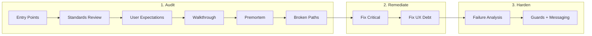

# Workflow Audit and Remediation Process

**Goal:** Systematically identify broken user paths, fix them, and harden edge cases across all functionality.

**References:**
- Pick Dialog UX Overhaul (orders/fulfillment) — premortem → remediation → hardening

---

## Premortem: This Process

*Assume we run this for 6 months and it fails — audits pile up, nothing gets hardened, or output is unusable. What went wrong?*

| Category | Failure Mode | Mitigation |
|----------|--------------|------------|
| **Critical** | No done criteria — practitioner never knows when audit is "complete" | Add explicit done criteria per phase |
| **Critical** | Scope too large — "Inventory" = 4 features; audit sprawls | One feature per audit; split domains |
| **Critical** | Backlog overwhelming — 13 domains, never starts | Timebox (1 audit per sprint); start with 3 |
| **User debt** | Walkthrough vague — "hit edge cases" but no checklist | Add standard edge-case checklist |
| **User debt** | Entry points missed — audit fixes one path but bulk/other path does something different | Add entry-points audit step |
| **Integration** | Remediation breaks conventions — e.g. re-adds reverted patterns, duplicates schema, introduces one-off patterns | Add Integration & Consistency Gate (2.0) before fixing |
| **User debt** | Template blank — no example of good premortem item | Add example items |
| **User debt** | No tracking — can't see progress across audits | Add status column to backlog |
| **Developer debt** | Process doc drifts from practice | Link to this doc from STANDARDS; review quarterly |

---

## Process Overview



---

## Phase 1: Audit

### 1.0 Entry Points Audit
*Learning from Shipping audit: bulk "Ship" on Orders list only updated status; no shipment records. Entry points were not systematically checked.*

**Before walkthrough:** Map every place the user can reach this feature. Don't assume "we know where it's used."

| Where to check | Examples |
|----------------|----------|
| Routes | Detail pages, list pages, dashboard tabs |
| Dashboard / home | Metric cards, quick actions, "View all" links |
| Bulk actions | List selection → bulk bar (allocate, ship, status update) |
| Toasts / notifications | Post-action "Ship Order", "Go to Fulfillment" |
| Context menus, dropdowns | Row actions, header actions |
| Alternate UIs | Kanban vs table; mobile vs desktop |

**For each entry point, verify:**
- [ ] Does it use the **canonical flow** (e.g. ShipOrderDialog) or a **different path** (e.g. bulk status-only)?
- [ ] If different: is that intentional? Document or flag as gap.
- [ ] Are there orphan UIs (e.g. kanban) not in the active route?

**Output:** Entry points table in premortem doc. Example (Shipping):

| Location | Entry | Uses ShipOrderDialog? |
|----------|-------|------------------------|
| Order detail | Fulfillment tab → Ship | Yes |
| Fulfillment dashboard | Shipping queue → Ship | Yes |
| Orders list | Bulk Ship | No — status only (gap) |

**Done when:** All routes, dashboards, bulk actions, and toasts checked; table complete.

### 1.1 Standards & Design System Review

*Before expectations or walkthrough: identify existing patterns the feature should align with. Avoid reinventing or diverging.*

| What to review | Where | Output |
|----------------|-------|--------|
| Code standards | STANDARDS.md | Container/presenter, hooks, query keys, barrel exports, route code-splitting |
| UI components | `src/components/ui`, `src/components/shared` | Primitives (Form, Dialog, Button), shared patterns (DataTable, empty states) |
| Domain patterns | Similar flows in codebase (e.g. other wizards, create dialogs) | Reference implementations to match |
| Design system (if applicable) | docs/DOCUMENT_DESIGN_SYSTEM.md, UI skills | Layout, typography, spacing for forms/dialogs |

**Checklist:**
- [ ] Does this flow follow container/presenter? Use centralized query keys? Barrel exports?
- [ ] Are we using existing Form, Dialog, Select, etc. — or introducing one-offs?
- [ ] Do similar flows (e.g. customer creation, quote creation) use patterns we should match?
- [ ] Any domain-specific standards (e.g. Money & Currency Units, schema location)?

**Output:** Standards compliance notes in premortem doc. Gaps (e.g. "wizard doesn't use shared step indicator") feed into premortem and remediation.

**Done when:** Checklist completed; compliance gaps documented or "No gaps" noted.

### 1.2 User Expectations (5-Question Process)

*Force high-agency thinking. No shallow fixes — understand expectations, then exceed them.*

| # | Question | Output |
|---|----------|--------|
| 1 | What does the end user (customer, employee, co-founder) expect from me? | List of expectations for this feature |
| 2 | How do I exceed those expectations? | List of "exceed" ideas |
| 3 | Are there any blockers from exceeding those expectations? | Blockers list (feeds into premortem) |
| 4 | What are all possible solutions to remove those blockers, and what are the trade-offs? | Solutions + trade-offs table |
| 5 | What solution do I believe is optimal to remove the blocker and exceed the end user's expectation? | Chosen solution per blocker |

**Representative user:** Same as walkthrough (e.g. "Sales rep", "Warehouse picker"). Answer from their perspective.

**Example (Order Creation):**
- **Q1 Expect:** "Create an order with customer + items and get to the order detail quickly."
- **Q2 Exceed:** Pre-fill customer when coming from customer page; save draft; copy from similar order; keyboard shortcuts.
- **Q3 Blockers:** No `?customerId=` deep link; no draft save; cancel loses everything.
- **Q4 Solutions:** Add URL param (low effort, high impact) vs session draft (medium effort) vs full draft API (high effort).
- **Q5 Optimal:** Add `?customerId=` for customer-context entry points.

**Output:** User expectations table in premortem doc. Blockers feed into 1.4 Premortem; optimal solutions feed into Phase 2 Remediate.

**Done when:** All 5 questions answered; at least one blocker identified or "No blockers" documented.

### 1.3 Walkthrough
Execute the workflow as a user would — desktop + mobile + edge cases.

**Scope discipline:** One feature per audit (e.g. "Picking", not "Orders"). Split large domains.

| Step | Action |
|------|--------|
| Pick a representative user | e.g. "Warehouse picker", "Sales rep", "Admin" |
| Map full workflow | Start → entry points (from 1.0) → core flow → completion |
| Trace a real scenario | Use real order IDs, customer names, etc. |
| Try desktop + mobile | If the flow has mobile entry points |
| Hit edge cases | Use standard checklist below |

**Standard edge-case checklist:**
- [ ] Empty state (no data, no items, no results)
- [ ] Serialized-only (when flow assumes non-serialized)
- [ ] Offline / queue sync (if applicable)
- [ ] Partial data (half-filled form, interrupted flow)
- [ ] URL params (deep links, search params)
- [ ] Permission boundary (user lacks permission mid-flow)

**Output:** Notes on where paths break, dead ends, or confuse.

**Done when:** At least one real scenario traced; edge-case checklist completed or N/A marked.

### 1.4 Premortem
Document "what could go wrong" as if it already failed.

| Category | Questions |
|----------|-----------|
| Critical bugs | What breaks immediately? |
| User debt | Where do users get stuck or confused? |
| Developer debt | What makes future changes risky? |

**Example items (from Pick Dialog):**
- Critical: "Mobile serialized-only orders show 'No pickable items' with no path forward"
- User debt: "Dialog closes after partial pick; user expects 'continue'"
- Developer debt: "Duplicate PickItem type in 3 files; changes require updates everywhere"

**Example items (from Shipping audit):**
- Critical: "Bulk Ship on Orders list only updates status; no shipment records, carrier, or tracking"
- User debt: "Empty state when all items shipped — no message explains why button is disabled"
- Developer debt: "Fulfillment kanban has onBulkShip but isn't in the active route; dead code or orphan"

**Output:** `docs/PREMORTEM_{DOMAIN}_{FEATURE}.md`

**Done when:** At least 1 item per category, or explicit "N/A" with reason. *If premortem finds nothing: document "No issues found" — that's a valid outcome; the audit still adds confidence.*

### 1.5 Broken Paths List
Prioritize fixes:

| Priority | Description |
|----------|-------------|
| P0 | Critical — user cannot complete the flow |
| P1 | UX debt — user can complete but with friction |
| P2 | Polish — edge cases, messaging, resilience |

**Done when:** Every premortem item mapped to P0/P1/P2; P0 list is actionable (can fix in one session).

---

## Phase 2: Remediate

### 2.0 Integration & Consistency Gate (Before Fixing)

*Learning from Shipping debt remediation: audit recommendations can conflict with established conventions. Remediation must integrate with the existing system, not introduce new patterns that break prior fixes or standards.*

**Before implementing any remediation item:**

| Check | Action |
|-------|--------|
| **Convention alignment** | Does this item conflict with STANDARDS.md, FORM-STANDARDS, or domain-specific rules? If the audit doc has a "Convention revert" or "Skipped" section, read it. Do not re-introduce reverted patterns. |
| **Prior reversions** | Has this exact recommendation been tried and reverted? (e.g. "Removed lib/constants/shipping.ts" — do not add it back unless the revert reason is addressed.) |
| **Pattern consistency** | Does the fix use the same patterns as similar flows? (e.g. useReducer where other containers use it; shared field components where forms use them; error helpers where catch blocks are similar.) |
| **Schema as source of truth** | For validation: does the fix duplicate schema logic or derive from it? Prefer schema + derived helpers over custom validation. |
| **Scope discipline** | Is this integration/refinement (fits in) or a rewrite (risky)? Prefer the former. |

**Output:** For each remediation item, either (a) implement per plan, (b) skip with reason (e.g. "Convention revert; keep inline"), or (c) adapt to an alternative that satisfies the check.

**Done when:** Every P0/P1 item has been checked against this gate before implementation.

### 2.1 Fix Critical (P0)
- Broken paths that block completion
- Missing links or fallbacks (e.g. "Open on desktop")
- API/validation mismatches

### 2.2 Fix UX Debt (P1)
- Unclear empty states
- Missing serialization/offline support
- Dialog closes when user expects "continue"

### 2.3 Remediation Checklist
- [ ] **Integration gate (2.0)** — Each item checked against conventions, prior reversions, and pattern consistency
- [ ] All entry points use canonical flow or gap is documented/removed
- [ ] All P0 paths have a fallback or clear error
- [ ] Empty states explain why and offer next action
- [ ] Mobile + desktop flows aligned where possible
- [ ] Offline/queue edge cases handled
- [ ] Smoke-test related flows (e.g. Order detail if Shipping changed) to catch regressions

**Done when:** All P0 fixed; checklist signed off; manual walkthrough passes.

---

## Phase 3: Harden

### 3.1 Failure-Mode Analysis
Ask: **"Where will it break first?"**

| Question | Check |
|----------|-------|
| Entry points | Bulk vs single-item; do they use same core flow? |
| Empty data | No serials, no inventory, no options |
| URL/params | Search params, coercion, validation |
| Offline sync | Queue items missing required fields |
| Race conditions | Refetch timing, invalidation |

### 3.2 Hardening Actions
- **Guards:** Pre-check before API calls; validate queue items before sync
- **Messaging:** Clear errors for serialized picks, offline failures, etc.
- **Feedback:** Loading indicators during refetch, "Refreshing…" toasts
- **Fallbacks:** "Open on desktop" when mobile can't complete

### 3.3 Hardening Checklist
- [ ] Empty states have helpful messages + action
- [ ] Search/URL params parse robustly
- [ ] Offline sync validates before submit
- [ ] Refetch/continue flows show clear feedback

**Done when:** "Where will it break first?" answered; guards + messaging added; checklist signed off.

### 3.4 Final Verification
Before marking Done, run this checklist:

- [ ] Entry points audit complete; no parallel paths with inconsistent behavior
- [ ] Full workflow traced: start → entry points → core flow → completion
- [ ] Manual walkthrough passes
- [ ] Empty/edge states have clear messaging
- [ ] Mobile + desktop flows aligned
- [ ] Offline sync (if applicable) handles edge cases

---

## Template: Workflow Audit Doc

```markdown
# Workflow Audit: {Domain} / {Feature}

## Scope
- **Domain:** e.g. Orders, Inventory, Support
- **Feature:** e.g. Picking, Receiving, RMA Creation
- **Canonical flow:** e.g. ShipOrderDialog, PickItemsDialog (the "right" way to do it)

## Entry Points
| Location | Entry | Uses canonical flow? | Notes |
|----------|-------|----------------------|-------|
| ... | ... | Yes/No | ... |

## Standards & Design System Review
- **Compliance:** [notes from STANDARDS.md, UI components, domain patterns]
- **Gaps:** [e.g. wizard doesn't use shared step indicator]

## User Expectations (5 Questions)
- **Q1 Expect:** ...
- **Q2 Exceed:** ...
- **Q3 Blockers:** ...
- **Q4 Solutions + trade-offs:** ...
- **Q5 Optimal:** ...

## Walkthrough
- **Scenario:** [describe]
- **Findings:** [broken paths, dead ends]

## Premortem
### Critical
- [ ] ...

### User Debt
- [ ] ...

### Developer Debt
- [ ] ...

## Broken Paths / Remediation Plan
*Map premortem items to P0/P1/P2.*
- [ ] P0: ...
- [ ] P1: ...
- [ ] P2: ...

## Hardening
- [ ] Failure mode: ...
- [ ] Guard: ...
```

---

## Candidate Backlog

**One feature per row** — split domains into specific flows. Status: `Not started` | `Audit` | `Remediate` | `Harden` | `Done`.

| Feature | Status | Priority | Notes |
|---------|--------|----------|-------|
| Orders / Picking | Done | — | Pick dialog, ship, mobile picking |
| Orders / Shipping | Done | — | Full remediation: Go to Fulfillment, ship-and-continue, ?ship=1, inline address errors, carrier Other, View Shipments link, kanban removed. See PREMORTEM_ORDERS_SHIPPING.md |
| Orders / Creation | Done | — | customerId pre-select, cancel confirmation, hardening. See PREMORTEM_ORDERS_CREATION.md |
| Inventory / Receiving | Not started | High | PO receiving, goods receipt |
| Inventory / Transfers | Not started | High | Stock transfers |
| Inventory / Stock counts | Not started | High | Cycle counts |
| Support / Issues | Not started | High | Issue creation, triage |
| Support / RMAs | Not started | High | RMA creation, returns |
| Projects / Site visits | Not started | High | Visit scheduling, check-in |
| Projects / Materials | Not started | High | Job materials, serials |
| Customers / Wizard | Not started | Medium | Customer creation flow |
| Pipeline / Quotes | Not started | Medium | Quote creation, approval |
| Financial / Invoices | Not started | Medium | Invoice creation, payments |
| Mobile / Entry points | Not started | High | Cross-cutting: all /mobile routes |

**Cross-cutting audits:** For items like "Mobile / Entry points," scope by *entry points for route/area* rather than a single feature. Run the same phases; the walkthrough covers "all entry points for `/mobile` routes" instead of one canonical flow.

---

## Execution Order

**Timebox:** 1 feature per sprint (or 2-week cycle). Start with top 3 by priority.

1. **Pick one feature** from backlog (Status = Not started)
2. **Run Phase 1** (audit) — entry points → standards review → user expectations → walkthrough → premortem → broken paths; update Status → Audit
3. **Run Phase 2** (remediate) — fix P0, then P1; update Status → Remediate
4. **Run Phase 3** (harden) — failure analysis + guards; update Status → Harden
5. **Run 3.4 Final Verification** — complete verification checklist
6. **Document** — create audit doc; update backlog Status → Done
7. **Repeat** for next feature

**Done** = all phase checklists complete and practitioner sign-off (or reviewer if applicable).

**Related docs:** [NO-EXPLICIT-ANY-REMEDIATION.md](./NO-EXPLICIT-ANY-REMEDIATION.md), [STANDARDS.md](../STANDARDS.md)

*This doc is linked from STANDARDS; review quarterly to keep process aligned with practice.*
