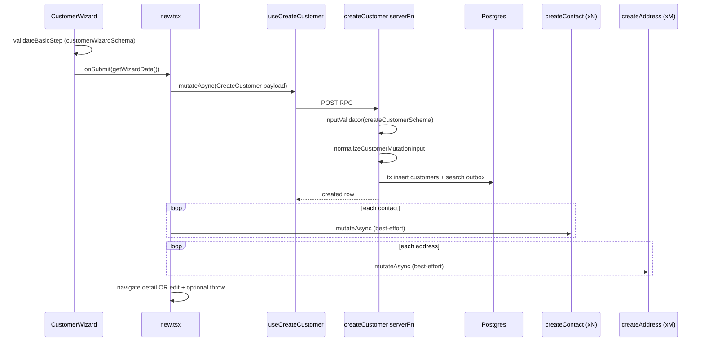

# 01 — Create customer (wizard)

**Status:** COMPLETE  
**Series order:** 01 (see [README](./README.md))  
**Last updated:** 2026-03-26  
**Standard:** [TRACE-STANDARD.md](./TRACE-STANDARD.md)

## 0. Capability & scope

**User capability:** Create a **customer row** in the current organization, optionally attaching **contacts** and **addresses** in the same session.

**In scope:** Route `/customers/new`, `CustomerWizard`, `createCustomer` server fn, post-create contact/address mutations, wizard error recovery via `getCustomerCreateSubmissionState`.

**Out of scope:** Customer edit, merge/duplicate UI, Xero linking, list filters, admin impersonation.

---

## 1. Trust boundary

| Concern | Source of truth |
|---------|-----------------|
| `organizationId`, `createdBy`, `updatedBy` | Server (`withAuth` + insert payload in `createCustomer` handler) |
| Customer field values | Client sends JSON; **validated** by `createCustomerSchema` on server; **trimmed** by `normalizeCustomerMutationInput` |
| Contact/address payloads | Client sends; each `createContact` / `createAddress` validates independently |
| Tags | Client string array; server schema caps length/count |

Client cannot set another org’s customer id (insert uses server org).

---

## 2. Entry points

| Surface | Path | Trigger |
|---------|------|---------|
| Primary | [`src/routes/_authenticated/customers/new.tsx`](../../src/routes/_authenticated/customers/new.tsx) | Navigate to `/customers/new` |
| Wizard UI | [`src/components/domain/customers/customer-wizard/index.tsx`](../../src/components/domain/customers/customer-wizard/index.tsx) | Renders steps + draft |
| Basic fields | [`src/components/domain/customers/customer-wizard/steps/basic-info-step.tsx`](../../src/components/domain/customers/customer-wizard/steps/basic-info-step.tsx) | Step 0 |

**Discovery:**

```bash
rg -n "useCreateCustomer|createCustomer\(" src/
rg -n "CustomerWizard" src/routes src/components/domain/customers
```

---

## 3. Sequence



**Saga note:** Customer insert is **one transaction**. Contacts/addresses are **N+M separate RPCs** after commit — **not atomic** with customer create.

---

## 4. Contracts

| Layer | Symbol | File |
|-------|--------|------|
| Wizard form (basic step) | `customerWizardSchema` | [`src/lib/schemas/customers/customer-wizard.ts`](../../src/lib/schemas/customers/customer-wizard.ts) |
| Canonical RPC input | `createCustomerSchema` | [`src/lib/schemas/customers/customers.ts`](../../src/lib/schemas/customers/customers.ts) (`createCustomerBaseSchema` + credit-hold refine) |
| TypeScript type | `CreateCustomer` | inferred from `createCustomerSchema` |
| Server gate | `.inputValidator(createCustomerSchema)` | [`createCustomer`](../../src/server/functions/customers/customers.ts) ~L575–577 |

**Normalization (server, post-Zod):** `normalizeCustomerMutationInput` in [`customer-write-helpers.ts`](../../src/server/functions/customers/customer-write-helpers.ts) — trims optional text fields to `undefined`, normalizes `xeroContactId` / `parentId` empties.

**Contacts/addresses:** Validated inside their own server fns (not re-exported here; trace separately if tightening).

---

## 5. AuthZ

- `withAuth({ permission: PERMISSIONS.customer.create })` inside `createCustomer` handler ([`customers.ts`](../../src/server/functions/customers/customers.ts) ~L578).

---

## 6. Persistence & side effects

| Step | Stores / queues | Transaction |
|------|-----------------|-------------|
| Customer create | `customers` insert; `enqueueCustomerSearchOutbox` | `runCustomerWriteTransaction` (single tx) |
| Activity | `logCustomerActivitySafely` async logger | outside critical path |
| Each contact | `customer_contacts` (via createContact) | per call |
| Each address | `customer_addresses` (via createAddress) | per call |

---

## 7. Failure matrix

| Condition | Error / HTTP | User sees | Code path |
|-----------|--------------|-----------|-----------|
| Wizard basic invalid | (client) | Toast + field errors | `useCustomerWizard` / TanStack Form |
| Server Zod reject | Structured validation | Mapped via `details.validationErrors` if present | `getCustomerCreateSubmissionState` |
| DB unique / conflict | 409 `ConflictError` / `ValidationError` | `getCustomerCreateConflictError` → user message | `createCustomer` catch ~L623–628 |
| Unexpected DB | 500 `ServerError` | Generic create failure | `createCustomer` ~L630–632 |
| Contact/address fail after customer OK | Aggregated | Toast “related records failed”; navigate to **edit**; error `PARTIAL_RELATED_CREATE_FAILURE` | `new.tsx` ~L234–257 |
| Full success | — | Success toast; navigate **detail** | `new.tsx` ~L260–261 |

**Wizard recovery:** [`submission-state.ts`](../../src/components/domain/customers/customer-wizard/submission-state.ts) — maps `validationErrors` to `fieldErrors`; `targetStepIndex` 0 if field errors else review step; `skipUiRecovery` when partial failure already redirected to edit.

---

## 8. Cache & read-after-write

- `useCreateCustomer` `onSuccess`: `invalidateQueries({ queryKey: queryKeys.customers.lists() })` ([`use-customers.ts`](../../src/hooks/customers/use-customers.ts) ~L207–209).
- **Gap:** No explicit `detail(customerId)` prime; user navigates to detail/edit — ensure those routes fetch fresh (typical TanStack Query).

---

## 9. Drift & technical debt

| Issue | Evidence | Risk |
|-------|----------|------|
| Duplicate Zod objects | `customerWizardBaseSchema` vs `createCustomerBaseSchema` (parallel fields + shared patterns) | Copy/paste drift on new fields |
| Duplicate business refine | Credit hold ⇒ reason in **both** wizard and create schemas | Double maintenance |
| Boundary casts | `new.tsx` `as` on `status`, `type`, `size` when building `CreateCustomer` | Runtime safe only if wizard enums ⊆ server enums |
| Non-atomic saga | Customer committed before contacts | Partial state; user must fix on edit |

---

## 10. Verification

- **Tests:** Search `createCustomer`, `customerWizard`, `getCustomerCreateSubmissionState` under `tests/`.
- **Gaps:** No mandatory integration test asserting partial-failure navigation + `skipUiRecovery` behavior; contract test that `CreateCustomer` parse(wizardOutput) succeeds for happy path.

---

## 11. Follow-up traces

- `createContact` / `createAddress` server fns vs `ContactManager` / `AddressManager` client schemas.
- Duplicate customer detection / merge entry points vs `getCustomerCreateConflictError` messages.
