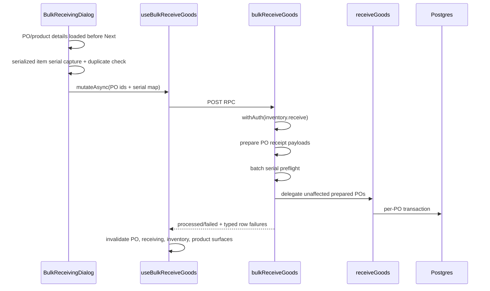

# 02 — Inventory “stock in” (increase on-hand)

**Status:** COMPLETE  
**Series order:** 02 (see [README](./README.md))  
**Last updated:** 2026-05-05
**Standard:** [TRACE-STANDARD.md](./TRACE-STANDARD.md)

## 0. Capability & scope

**User capability:** Increase **quantity on hand** (and related valuation layers) for a product at a location, using one of several workflows that all feel like “receive” or “stock in” in the UI.

**In scope:** Ad-hoc receiving (`receiveInventory`), product-detail receive launch into ad-hoc receiving, PO goods receipt (`receiveGoods`), and the bulk PO receipt wrapper (`bulkReceiveGoods`). AuthZ, canonical Zod contracts, transactions, cache behavior, and failure mapping at a high level per path.

**Out of scope:** **Stock adjustments** (`adjustInventory` — different narrative), **RMA receive** (`receiveRma` — returns path), serial lifecycle beyond receive rules, full line-by-line SQL inside `receiveGoods` (see server comment block in source).

---

## 1. Trust boundary

| Concern | Source of truth |
|---------|-----------------|
| `organizationId`, actor ids | Server (`withAuth` + RLS `set_config('app.organization_id', …)` inside transactions) |
| Product / location / PO ids | Client sends UUIDs; server verifies row exists **for org** |
| Quantities, unit cost, serial/lot | Client sends; **validated** by per-fn Zod schemas; serialized rules enforced again in handler |
| PO line quantities (receiveGoods) | Client sends accepted qty; server reconciles against PO and updates `quantityReceived` / status |

Client cannot impersonate another org: queries always scoped by `ctx.organizationId` and/or session config.

---

## 2. Entry points (multiple — friction accumulator)

| # | Entry | Route / component | Server function | Permission (handler) |
|---|-------|-------------------|-----------------|------------------------|
| A | **Ad-hoc receiving** | [`receiving-page.tsx`](../../src/routes/_authenticated/inventory/receiving-page.tsx) → [`ReceivingForm`](../../src/components/domain/inventory/receiving/receiving-form.tsx); mobile [`-receiving-page.tsx`](../../src/routes/_authenticated/mobile/-receiving-page.tsx); product detail launch via [`inventory-tab-container.tsx`](../../src/components/domain/products/tabs/inventory-tab-container.tsx) | `receiveInventory` — [`receiving.ts`](../../src/server/functions/inventory/receiving.ts) | `PERMISSIONS.inventory.receive` |
| B | **PO goods receipt** | [`goods-receipt-dialog.tsx`](../../src/components/domain/purchase-orders/receive/goods-receipt-dialog.tsx) (and related PO UI) | `receiveGoods` — [`receive-goods.ts`](../../src/server/functions/suppliers/receive-goods.ts) | `PERMISSIONS.inventory.receive` |
| C | **Bulk PO receipts** | Purchase-order list bulk receiving dialog via [`bulk-receiving-dialog-container.tsx`](../../src/components/domain/procurement/receiving/bulk-receiving-dialog-container.tsx) / [`bulk-receiving-dialog.tsx`](../../src/components/domain/procurement/receiving/bulk-receiving-dialog.tsx) | `bulkReceiveGoods` — [`bulk-receive-goods.ts`](../../src/server/functions/suppliers/bulk-receive-goods.ts) | `PERMISSIONS.inventory.receive`, then delegates each prepared PO to `receiveGoods` |

**Discovery:**

```bash
rg -n "useReceiveInventory|receiveInventory\(" src/
rg -n "useReceiveGoods|receiveGoods\(" src/
rg -n "bulkReceiveGoods|receiveStock|recordMovement" src/
```

**Friction:** English “Receive” / “stock in” may map to **different** APIs and preconditions: non-PO stock-in uses `receiveInventory`; PO receipt uses `receiveGoods`; old product inventory wrappers delegate to canonical inventory functions and are not current UI entry points.

---

## 3. Authoritative contracts

| Path | Canonical Zod | Export / location |
|------|-----------------|-------------------|
| Ad-hoc | `receiveInventorySchema` | [`receiving.ts`](../../src/lib/schemas/inventory/receiving.ts) (imported by the server function and passed to `.inputValidator`) |
| PO receipt | `receiveGoodsSchema` | [`receive-goods.ts`](../../src/server/functions/suppliers/receive-goods.ts) |
| Bulk PO receipt | `bulkReceiveGoodsSchema` | [`bulk-receive-goods.ts`](../../src/server/functions/suppliers/bulk-receive-goods.ts) |
| Product receive wrapper | `receiveStockSchema` | [`receiving.ts`](../../src/lib/schemas/inventory/receiving.ts), used by [`product-inventory.ts`](../../src/server/functions/products/product-inventory.ts) before delegating to `receiveInventory` |

**Secondary (UI):** `receivingFormBaseSchema` + `superRefine` in [`receiving-form.tsx`](../../src/components/domain/inventory/receiving/receiving-form.tsx) uses the shared manual receive serialization helper in [`receiving.ts`](../../src/lib/schemas/inventory/receiving.ts), matching server receive validation.

**Secondary (bulk PO UI):** `BulkReceivingDialogContainer` loads selected PO details and product serialization requirements before the presenter can advance. `BulkReceivingDialog` captures serials for serialized pending items, blocks duplicate same-product serials before review, and returns `invalid_serial_state` failures to serial review instead of blindly retrying the same payload.

---

## 4. Sequence

### A — `receiveInventory` (ad-hoc)

```mermaid
sequenceDiagram
  participant P as ReceivingPage
  participant F as ReceivingForm
  participant H as useReceiveInventory
  participant S as receiveInventory
  participant DB as Postgres

  P->>F: product + location + qty + cost
  F->>F: receivingFormBaseSchema + superRefine
  F->>H: mutateAsync(payload)
  H->>H: optimistic patch lists/details
  H->>S: POST RPC
  S->>S: withAuth(inventory.receive)
  S->>S: serialized rules
  S->>DB: tx + row lock, balances, movements, layers
  S-->>H: result
  H->>H: invalidate lists, details, lowStock; movements on settled
```

**Concurrency:** Handler uses **row lock** when loading/updating inventory (`for('update')` pattern in same file) to reduce lost updates.

### B — `receiveGoods` (PO)

High-level pipeline (see file header comment in [`receive-goods.ts`](../../src/server/functions/suppliers/receive-goods.ts) ~L100–108): receipt header → lines → movements (`purchase_in`) → cost layers → balance updates → PO line `quantityReceived` / pending → PO status → optional `product.costPrice` weighted average. **Single transaction** from handler entry.

### C — `bulkReceiveGoods` (bulk PO receipts)



Bulk receiving intentionally preserves the existing partial-failure contract: invalid or failed POs return row failures while unaffected prepared POs can still delegate to `receiveGoods`. The server preflights duplicate same-product serials across the batch before any `receiveGoods` delegation, so a self-contradictory serial request cannot receipt the first PO and fail only after the duplicated serial reaches a later PO.

### D — product inventory wrappers

`receiveStock` and `recordMovement` preserve legacy product-inventory exports but route receive movements to `receiveInventory`, so the manual receive permission, validation, transaction, cost-layer, serialized-lineage, and cache contract stay canonical. `adjustStock` and `transferStock` similarly delegate to their inventory-domain endpoints.

---

## 5. Persistence & side effects

| Path | Primary tables / domains | Transaction |
|------|---------------------------|-------------|
| `receiveInventory` | `inventory`, movements, cost layers (per implementation in handler) | Single `db.transaction` |
| `receiveGoods` | PO receipt + inventory + layers + PO lines + product cost | Single `db.transaction` |
| `bulkReceiveGoods` | Delegates prepared POs to `receiveGoods`; row failures remain outside the per-PO transaction | Per successful PO via delegated transaction |
| `receiveStock` / receive `recordMovement` | Delegates to `receiveInventory` | Delegated transaction |

Side effects outside row writes: toasts from [`useReceiveInventory`](../../src/hooks/inventory/use-inventory.ts); PO list invalidation typically via callers of `useReceiveGoods` (trace separately if tightening).

---

## 6. Failure matrix

| Condition | Typical error | User-visible (ad-hoc path) | Notes |
|-----------|---------------|----------------------------|--------|
| Zod reject (bad UUID, qty) | Validation | Depends on caller; form should pre-validate | Server is final gate |
| Product not found | `NotFoundError` | Generic receive failure toast | `receiveInventory` ~L1730 |
| Serialized rules | `ValidationError` | Stable receive failure guidance with field/code guidance where structured | serial required, qty ≠ 1, serial on non-serialized |
| Location not found | `NotFoundError` | Same | inside tx |
| Mutation failure after optimistic update | — | Stable receive failure guidance + **rollback** cached lists | `useReceiveInventory` `onError`; desktop/mobile route surfaces also suppress raw server text |
| PO wrong status / over-receive | Serialized mutation error envelope | PO UI mapping | `receiveGoods` uses `createSerializedMutationError` in several branches |
| Bulk serialized serial validation | `invalid_serial_state` row failure | Bulk dialog returns failed rows to serial review | Missing/empty/duplicate serials; batch duplicate preflight also uses this code |
| Bulk mixed outcome | Success envelope with `processed`, `failed`, `errors[]`, `errorsById`, `partialFailure` | Failed rows listed; retry/review action depends on row code | `errorsById` is message-only; `errors[]` carries optional row `code` |

---

## 7. Cache / read-after-write

[`useReceiveInventory`](../../src/hooks/inventory/use-inventory.ts): **optimistic** update of `queryKeys.inventory.lists()` and `details()` on mutate; **rollback** on error; **invalidate** lists, details, `lowStock()`, WMS, valuation, finance-integrity, serialized list, available serials, product detail/inventory/stats/alerts/movements, and movement prefixes according to the manual receive cache contract.

**Stale window:** Brief inconsistency if server rejects after optimistic patch until `onError` restores prior cache.

[`useReceiveGoods`](../../src/hooks/suppliers/use-goods-receipt.ts): invalidates PO detail, PO list, PO receipts, inventory, and product surfaces after a single PO receipt.

[`useBulkReceiveGoods`](../../src/hooks/suppliers/use-bulk-receive-goods.ts): invalidates purchase-order list, status counts, receiving summary, pending approvals, each affected PO detail/items/receipts, inventory, and product surfaces after the bulk mutation returns. It does not perform optimistic updates.

---

## 8. Drift & technical debt

| Issue | Evidence | Risk |
|-------|----------|------|
| Serialized rule contract | Shared helper feeds UI and server validation | Keep future serialized receive rule changes in `src/lib/schemas/inventory/receiving.ts` |
| Bulk receive row failure shape | `errors[]` carries optional row `code`; `errorsById` remains message-only | Future callers should prefer `errors[]` when deciding operator recovery |
| Stale workflow memory | Prior trace referenced a product batch receive endpoint, but no live export or caller exists | Docs can train maintainers toward phantom APIs if not guarded |
| “Stock in” vocabulary | Adjust vs receive vs RMA | Wrong operator training; wrong API for support |

---

## 9. Verification

- **Tests:** Search `receiveInventory`, `receiveGoods`, `ReceivingForm` under `tests/`.
- **Guard:** `tests/unit/inventory/stock-in-workflow-trace.test.ts` verifies the stock-in trace does not document a non-existent product bulk receive endpoint and that product receive wrappers delegate to canonical manual receiving.
- **Guard:** `tests/unit/inventory/stock-in-workflow-trace.test.ts` verifies the stock-in trace documents the live bulk PO receipt preflight, typed row failure, and cache invalidation contract.
- **Guard:** `tests/unit/inventory/manual-receive-serialization-contract.test.ts` verifies manual receive serialization rules and shared helper usage.
- **Gaps:** Integration test for optimistic rollback on forced failure.

---

## 10. Follow-up traces

- `adjustInventory` vs receive: when to use which (support doc).
- `receiveRma` return-to-stock path.
- Product inventory wrappers vs direct inventory-domain endpoints, if any caller starts using them again.
