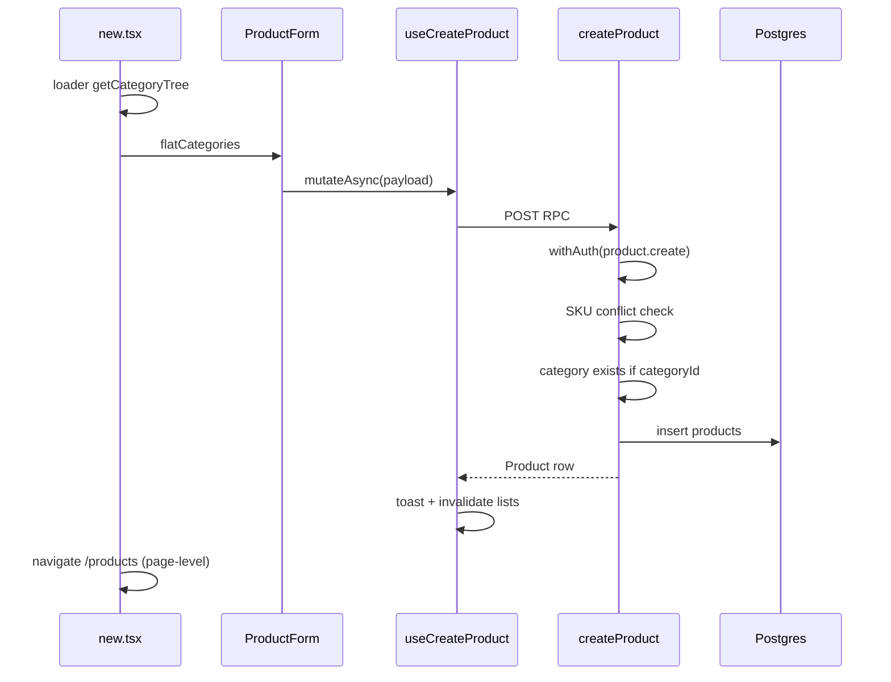

# 04 — Create product

**Status:** COMPLETE  
**Series order:** 04 (see [README](./README.md))  
**Last updated:** 2026-03-26  
**Standard:** [TRACE-STANDARD.md](./TRACE-STANDARD.md)

## 0. Capability & scope

**User capability:** Create a **product** row (SKU, pricing, status, optional category, metadata, etc.) scoped to the current organization.

**In scope:** Route `/products/new`, loader `getCategoryTree`, `ProductForm`, `useCreateProduct` → `createProduct` server fn.

**Out of scope:** Product edit dialog, import CSV, inventory levels (separate mutations), images/assets pipeline.

---

## 1. Trust boundary

| Concern | Source of truth |
|---------|-----------------|
| `organizationId`, `createdBy`, `updatedBy` | Server |
| `sku` uniqueness | Server checks existing non-deleted row per org before insert |
| `categoryId` | Optional UUID from client; server verifies category exists for org |
| Field payloads | `createProductSchema` on server; client may coerce nulls → undefined in route handler |

---

## 2. Entry points

| Surface | Path |
|---------|------|
| Route | [`src/routes/_authenticated/products/new.tsx`](../../src/routes/_authenticated/products/new.tsx) |
| Form | [`ProductForm`](../../src/components/domain/products/) (barrel export) |
| Mutation | [`useCreateProduct`](../../src/hooks/products/use-products.ts) |

**Discovery:**

```bash
rg -n "useCreateProduct|createProduct\(" src/
```

---

## 3. Sequence



**Note:** `useCreateProduct` shows a toast with “View Product” → navigates to detail; `new.tsx` **also** `navigate({ to: '/products' })` after `mutateAsync` — user lands on list; toast action still offers detail navigation.

---

## 4. Contracts

| Layer | Symbol | File |
|-------|--------|------|
| Canonical RPC | `createProductSchema`, `CreateProduct` | [`src/lib/schemas/products/products.ts`](../../src/lib/schemas/products/products.ts) ~L129 |
| Server gate | `.inputValidator(createProductSchema)` | [`createProduct`](../../src/server/functions/products/products.ts) ~L361–363 |
| UI values | `ProductFormValues` | product form module (aligns with schema fields; trace form file if tightening) |

**Server cast:** `metadata` passed through as typed object for Drizzle ([`products.ts`](../../src/server/functions/products/products.ts) ~L400–407).

---

## 5. AuthZ

`withAuth({ permission: PERMISSIONS.product.create })` in `createProduct` handler.

---

## 6. Persistence & side effects

Single `db.insert(products).values(...).returning()` — **no** transaction wrapper in handler (single statement). No search outbox in this handler path (verify separately if products are indexed elsewhere).

---

## 7. Failure matrix

| Condition | Error | User-visible |
|-----------|-------|--------------|
| Zod reject | Validation error | Toast via `onError` in hook |
| Duplicate SKU | `ConflictError` | `error.message` in toast |
| Invalid category | `ValidationError` | Field/category messaging |
| Permission denied | `PermissionDeniedError` (from `withAuth`) | Generic mutation failure |

---

## 8. Cache & read-after-write

`useCreateProduct` `onSuccess`: `invalidateQueries({ queryKey: queryKeys.products.lists() })`. **Does not** prime `detail(newProduct.id)`; list refetch picks up new row.

---

## 9. Drift & technical debt

| Issue | Evidence | Risk |
|-------|----------|------|
| Dual navigation intent | Hook toast “View Product” vs page navigate to list | Slight UX confusion |
| Form vs schema drift | `ProductFormValues` vs `createProductSchema` | New field added on one side only |

---

## 10. Verification

- Search `createProduct`, `ProductForm`, `new.tsx` under `tests/`.
- **Gap:** Contract test parse(`ProductFormValues` → `CreateProduct`) for happy path; SKU conflict assertion.

---

## 11. Follow-up traces

- Product edit / status transitions.
- Bulk import pipeline (`import.tsx`).
