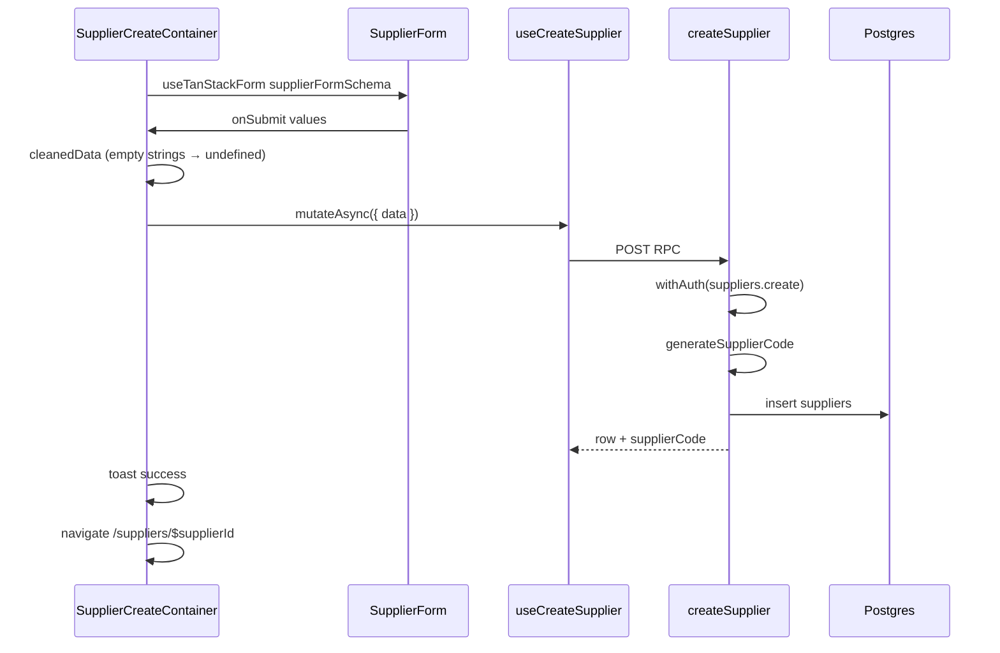

# 05 — Create supplier

**Status:** COMPLETE  
**Series order:** 05 (see [README](./README.md))  
**Last updated:** 2026-03-26  
**Standard:** [TRACE-STANDARD.md](./TRACE-STANDARD.md)

## 0. Capability & scope

**User capability:** Create a **supplier** with contact, address, and commercial fields; server assigns **supplier code**.

**In scope:** Route `/suppliers/create`, `SupplierCreateContainer`, `SupplierForm`, `useCreateSupplier` → `createSupplier`.

**Out of scope:** Supplier edit, performance metrics, PO creation, receive-goods.

---

## 1. Trust boundary

| Concern | Source of truth |
|---------|-----------------|
| `organizationId`, `createdBy`, `updatedBy` | Server |
| `supplierCode` | **Generated** server-side (`generateSupplierCode`); client cannot set |
| Field values | Client → cleaned in container (`''` → `undefined` for optionals) → `createSupplierSchema` on server |
| Uniqueness | DB unique constraints; handler maps `23505` to `ValidationError` with field hints |

---

## 2. Entry points

| Surface | Path |
|---------|------|
| Route | [`src/routes/_authenticated/suppliers/create.tsx`](../../src/routes/_authenticated/suppliers/create.tsx) |
| Container | [`supplier-create-container.tsx`](../../src/components/domain/suppliers/supplier-create-container.tsx) |
| Form | [`supplier-form.tsx`](../../src/components/domain/suppliers/supplier-form.tsx) |
| Mutation | [`useCreateSupplier`](../../src/hooks/suppliers/use-suppliers.ts) |

**Discovery:**

```bash
rg -n "useCreateSupplier|createSupplier\(" src/
```

---

## 3. Sequence



---

## 4. Contracts

| Layer | Symbol | File |
|-------|--------|------|
| Form (client) | `supplierFormSchema`, `SupplierFormValues` | [`src/lib/schemas/suppliers/supplier-form.ts`](../../src/lib/schemas/suppliers/supplier-form.ts) |
| Canonical RPC | `createSupplierSchema`, `CreateSupplierInput` | [`src/lib/schemas/suppliers/index.ts`](../../src/lib/schemas/suppliers/index.ts) ~L102 |
| Server gate | `.inputValidator(createSupplierSchema)` | [`createSupplier`](../../src/server/functions/suppliers/suppliers.ts) ~L342–344 |

**Drift vector:** Form defaults use `supplierType: null`, `paymentTerms: null`; container maps to `undefined` for RPC. Server schema must accept optional/nullable alignment for those fields.

---

## 5. AuthZ

`withAuth({ permission: PERMISSIONS.suppliers.create })` in `createSupplier` handler.

---

## 6. Persistence & side effects

Single `db.insert(suppliers).values(...).returning()` with try/catch for `23505`. Activity log `logger.logAsync` after insert ([`suppliers.ts`](../../src/server/functions/suppliers/suppliers.ts) following ~L401).

---

## 7. Failure matrix

| Condition | Error | User-visible |
|-----------|-------|--------------|
| Zod reject | Validation | TanStack Form + toast on throw |
| Duplicate email | `ValidationError` (mapped from PG) | Toast from container catch |
| Supplier code race | `ValidationError` “retry” | Toast |
| Permission denied | From `withAuth` | Toast |

---

## 8. Cache & read-after-write

`useCreateSupplier` `onSuccess`: `invalidateQueries({ queryKey: queryKeys.suppliers.suppliersList() })`. **Does not** prime `supplierDetail(newId)`; detail page will fetch.

---

## 9. Drift & technical debt

| Issue | Evidence | Risk |
|-------|----------|------|
| Two schemas | `supplierFormSchema` vs `createSupplierSchema` | Field added to one only |
| Null vs undefined | Form nulls; RPC undefined | Subtle Zod optional mismatches |

---

## 10. Verification

- Search `createSupplier`, `SupplierCreateContainer` under `tests/`.
- **Gap:** PG `23505` branch tests for email vs code constraint messages.

---

## 11. Follow-up traces

- Supplier update and soft-delete.
- `generateSupplierCode` collision / retry semantics under load.
