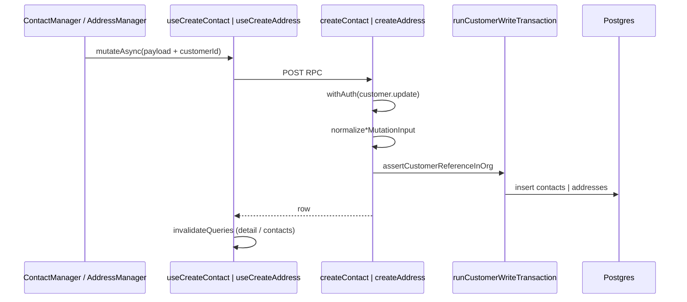

# 07 — Create customer contact & address

**Status:** COMPLETE  
**Series order:** 07 (see [README](./README.md))  
**Last updated:** 2026-03-26  
**Standard:** [TRACE-STANDARD.md](./TRACE-STANDARD.md)

## 0. Capability & scope

**User capability:** Add a **contact** or **address** row linked to an existing **customer** in the current organization.

**In scope:** `createContact`, `createAddress` server functions; `useCreateContact` / `useCreateAddress`; primary UI (`ContactManager`, `AddressManager`); post–customer-create saga calls from [01-customer-create](./01-customer-create.md).

**Out of scope:** Update/delete contact & address (same files, separate mutations); Xero contact sync; bulk import.

---

## 1. Trust boundary

| Concern | Source of truth |
|---------|-----------------|
| `organizationId`, `createdBy`, `updatedBy` | Server on **contacts** (handler sets user ids). **Addresses** table uses `timestampColumns` only — no `createdBy` / `updatedBy` columns in Drizzle schema ([`customers.ts`](../../drizzle/schema/customers/customers.ts) `addresses` vs `contacts` + `auditColumns`) |
| `customerId` | Client UUID; **asserted** inside `runCustomerWriteTransaction` via `assertCustomerReferenceInOrg` (customer must exist, same org, not deleted) |
| Field payloads | Client JSON → **Zod** (`createContactSchema` / `createAddressSchema`) → **normalize** `normalizeContactMutationInput` / `normalizeAddressMutationInput` |

---

## 2. Entry points

| Surface | Path |
|---------|------|
| Contact / address managers | [`contact-manager.tsx`](../../src/components/domain/customers/contact-manager.tsx), [`address-manager.tsx`](../../src/components/domain/customers/address-manager.tsx) |
| Customer create saga | [`new.tsx`](../../src/routes/_authenticated/customers/new.tsx) — sequential `useCreateContact` / `useCreateAddress` after `createCustomer` |
| Customer edit submission | [`use-customer-edit-submission.ts`](../../src/hooks/customers/use-customer-edit-submission.ts) |

**Discovery:**

```bash
rg -n "useCreateContact|createContact\(" src/
rg -n "useCreateAddress|createAddress\(" src/
```

---

## 3. Sequence



**Saga (with 01):** Each create is its **own** transaction on the server — **not** bundled with the parent customer insert. Partial success is possible and is handled at the wizard level in trace 01.

---

## 4. Contracts

| Layer | Symbol | File |
|-------|--------|------|
| Canonical RPC (contact) | `createContactSchema`, `CreateContact` | [`src/lib/schemas/customers/customers.ts`](../../src/lib/schemas/customers/customers.ts) ~L242 |
| Canonical RPC (address) | `createAddressSchema`, `CreateAddress` | same file ~L288 |
| Server | `.inputValidator(createContactSchema)` / `createAddressSchema` | [`customers.ts`](../../src/server/functions/customers/customers.ts) ~L839–840, ~L948–949 |
| UI (contact) | `contactFormSchema` | [`contact-manager.tsx`](../../src/components/domain/customers/contact-manager.tsx) ~L63 — **local Zod**, not imported from `createContactSchema` |
| UI (address) | `addressFormSchema` | [`address-manager.tsx`](../../src/components/domain/customers/address-manager.tsx) ~L60 — **local Zod** |

**Normalization:** [`customer-write-helpers.ts`](../../src/server/functions/customers/customer-write-helpers.ts) — trims optional text fields on contact/address payloads.

---

## 5. AuthZ

Both handlers use `withAuth({ permission: PERMISSIONS.customer.update })` — **not** `customer.create`. A user who can create a net-new customer (wizard) still needs **update** permission for these RPCs when adding contacts later; align product expectation with RBAC matrix.

---

## 6. Persistence & side effects

| Mutation | Storage | Transaction |
|----------|---------|-------------|
| `createContact` | `contacts` insert | `runCustomerWriteTransaction` (single tx per call) |
| `createAddress` | `addresses` insert | same pattern |

No customer search outbox enqueue in these handlers (unlike `createCustomer`).

---

## 7. Failure matrix

| Condition | Error | User-visible |
|-----------|-------|--------------|
| Zod reject | Validation | Form errors / toast (per caller) |
| Customer not in org / deleted | From `assertCustomerReferenceInOrg` | Mutation error |
| Permission denied | `PermissionDeniedError` | Standard |
| Wizard partial failure (01) | Aggregated client handling | Redirect to edit + toast |

---

## 8. Cache & read-after-write

- **`useCreateContact`:** invalidates `queryKeys.customers.detail(customerId)` and `queryKeys.contacts.byCustomer(customerId)`.
- **`useCreateAddress`:** invalidates `queryKeys.customers.detail(customerId)` only (no `contacts`-style secondary key for addresses — possible stale specialized queries if any exist).

**Asymmetry:** `useUpdateContact` / `useDeleteContact` invalidate `queryKeys.customers.all` + `contacts.all`, while create contact is narrower — intentional or oversight (audit note).

---

## 9. Drift & technical debt

| Issue | Evidence | Risk |
|-------|----------|------|
| Duplicate contact Zod | `contactFormSchema` vs `createContactSchema` (email: optional+literal `''` vs `optionalEmailSchema`) | Client passes validation, server rejects or normalizes differently |
| Duplicate address Zod | `addressFormSchema` vs `createAddressSchema` (e.g. `country` default only on server schema) | Empty country might slip on client |
| AuthZ naming | Create-like RPC gated by `customer.update` | Confusing for operators and policy reviews |
| Address vs contact audit | Contacts have `auditColumns`; addresses do not | “Who created this address?” is weaker than contacts for compliance/support |

---

## 10. Verification

- Search `createContact`, `createAddress`, `ContactManager`, `AddressManager` under `tests/`.
- **Gap:** Contract test that `contactFormSchema` parse output maps to `createContactSchema` safeParse; same for address. Permission test: role with `customer.create` but not `customer.update` cannot add contact via API.

---

## 11. Follow-up traces

- `updateContact` / `updateAddress` / delete flows and primary-flag semantics.
- `assertCustomerReferenceInOrg` implementation (locking, soft-delete rules).
