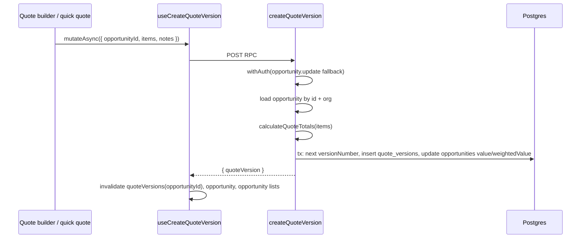

# 08 — Create quote version (pipeline)

**Status:** COMPLETE  
**Series order:** 08 (see [README](./README.md))  
**Last updated:** 2026-03-26  
**Standard:** [TRACE-STANDARD.md](./TRACE-STANDARD.md)

## 0. Capability & scope

**User capability:** Save an **immutable quote version** (line items + notes) against a **pipeline opportunity**, with server-calculated subtotal, GST, and total; optionally used from quote builder / quick quote UI.

**In scope:** `createQuoteVersion` server function, `createQuoteVersionSchema`, `useCreateQuoteVersion`, totals math in [`quote-versions.tsx`](../../src/server/functions/pipeline/quote-versions.tsx).

**Out of scope:** Restore version, extend validity, PDF generation, send quote email, legacy `createQuoteSchema` ([`pipeline.ts`](../../src/lib/schemas/pipeline/pipeline.ts) “Legacy” section) unless a live server fn still uses it.

---

## 1. Trust boundary

| Concern | Source of truth |
|---------|-----------------|
| `organizationId`, `createdBy`, version number | Server / transaction |
| `opportunityId` | Client UUID; server loads opportunity and checks `organizationId` |
| Line `quantity`, `unitPrice`, `discountPercent` | Client; **line totals and invoice totals recomputed** on server (`calculateLineItemTotal`, `calculateQuoteTotals`) |
| `items[].total` in Zod | Required on input schema but **overwritten** server-side when building `processedItems` — client value is not authoritative |

---

## 2. Entry points

| Surface | Path |
|---------|------|
| Mutation hook | [`use-quote-mutations.ts`](../../src/hooks/pipeline/use-quote-mutations.ts) — `useCreateQuoteVersion` |
| Server | [`quote-versions.tsx`](../../src/server/functions/pipeline/quote-versions.tsx) — `createQuoteVersion` |
| UI containers | [`quote-builder-container.tsx`](../../src/components/domain/pipeline/quotes/quote-builder-container.tsx), [`quick-quote-form-container.tsx`](../../src/components/domain/pipeline/quotes/quick-quote-form-container.tsx) |

**Discovery:**

```bash
rg -n "useCreateQuoteVersion|createQuoteVersion\(" src/
```

---

## 3. Sequence



**Concurrency:** Next `versionNumber` is computed **inside** the transaction (latest row + 1) to reduce duplicate version races under concurrent saves.

---

## 4. Contracts

| Layer | Symbol | File |
|-------|--------|------|
| Line item | `quoteLineItemSchema`, `QuoteLineItem` | [`src/lib/schemas/pipeline/pipeline.ts`](../../src/lib/schemas/pipeline/pipeline.ts) ~L307 |
| Canonical RPC | `createQuoteVersionSchema`, `CreateQuoteVersion` | same file ~L323 |
| Server validator | `.inputValidator(createQuoteVersionSchema)` | [`quote-versions.tsx`](../../src/server/functions/pipeline/quote-versions.tsx) ~L98–99 |

**GST:** Server uses `GST_RATE` from [`@/lib/order-calculations`](../../src/lib/order-calculations) in `calculateQuoteTotals` — comment at file top says 10% AUD; keep aligned with product tax rules elsewhere.

---

## 5. AuthZ

`withAuth({ permission: PERMISSIONS.opportunity?.update ?? 'opportunity:update' })` — creating a quote version is modeled as **updating** the opportunity, not a separate `quote:create` permission.

---

## 6. Persistence & side effects

| Step | Stores | Transaction |
|------|--------|-------------|
| Insert | `quote_versions` (JSON `items`, monetary columns) | Single `db.transaction` |
| Update | `opportunities.value`, `opportunities.weightedValue` | Same tx |

**Side effect:** Opportunity list cards and metrics may change because `value` is overwritten to quote **total** (not weighted deal value from stage probability alone — `weightedValue` is recomputed using existing opportunity `probability`).

---

## 7. Failure matrix

| Condition | Error | User-visible |
|-----------|-------|--------------|
| Zod reject | Validation | Form / mutation toast |
| Opportunity missing | `NotFoundError` | Error message |
| Permission denied | `PermissionDeniedError` | Standard |
| DB / tx failure | 5xx / wrapped | Generic save failure |

---

## 8. Cache & read-after-write

`onSuccess`: invalidates `queryKeys.pipeline.quoteVersions(opportunityId)`, `queryKeys.pipeline.opportunity(opportunityId)`, `queryKeys.opportunities.lists()`.

---

## 9. Drift & technical debt

| Issue | Evidence | Risk |
|-------|----------|------|
| Required `total` on line items ignored | Schema requires `total`; handler replaces with `calculateLineItemTotal` | Confusing API; clients can pass wrong `total` and still “succeed” |
| File extension | Server module is `.tsx` but hook comment references `.ts` | Doc/tooling drift |
| Opportunity value semantics | Quote total overwrites `opportunities.value` | Pipeline reporting may disagree with user intent if quote is exploratory |
| Legacy `createQuoteSchema` | Still in `pipeline.ts` | Dead code or hidden caller — grep before deleting |

---

## 10. Verification

- Search `createQuoteVersion`, `calculateQuoteTotals` under `tests/`.
- **Gap:** Concurrent double-submit: two tabs save same opportunity → both succeed with sequential version numbers (OK); assert totals match recomputed line math. Schema test: strip `total` from input and ensure server still accepts if Zod is relaxed in future.

---

## 11. Follow-up traces

- `sendQuote` + email delivery and document records.
- `restoreQuoteVersion` (branching version history).
