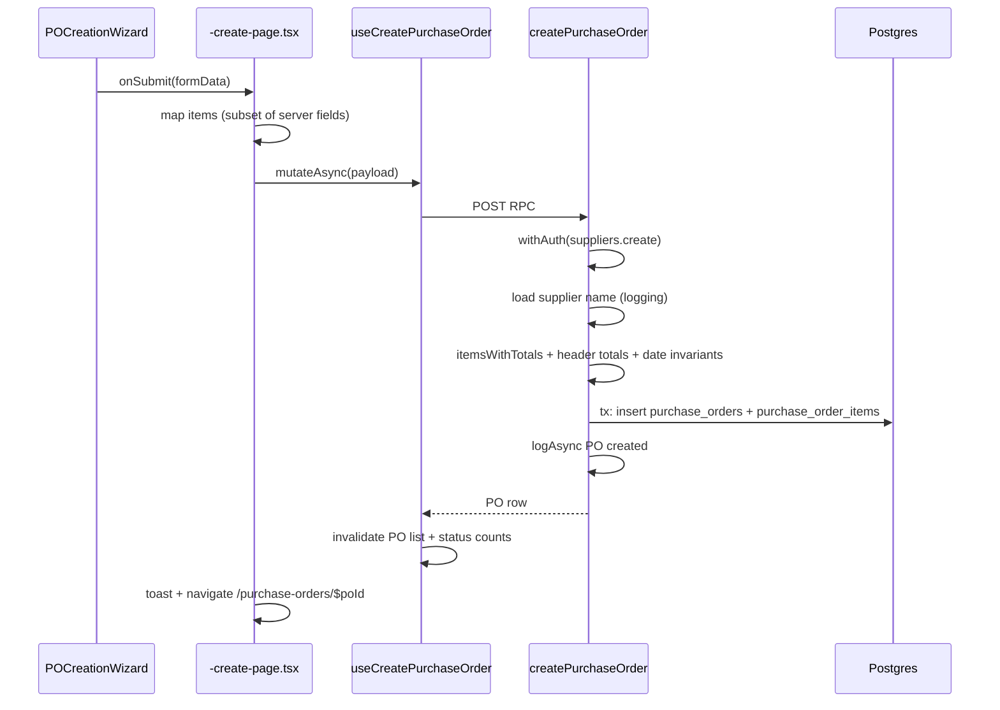

# 09 — Create purchase order

**Status:** COMPLETE  
**Series order:** 09 (see [README](./README.md))  
**Last updated:** 2026-03-26  
**Standard:** [TRACE-STANDARD.md](./TRACE-STANDARD.md)

## 0. Capability & scope

**User capability:** Create a **draft purchase order** for a supplier with one or more line items, persisted with server-calculated line totals and PO header totals.

**In scope:** `createPurchaseOrder` in [`purchase-orders.ts`](../../src/server/functions/suppliers/purchase-orders.ts), `useCreatePurchaseOrder`, primary wizard page [`-create-page.tsx`](../../src/routes/_authenticated/purchase-orders/-create-page.tsx), and secondary callers (forecast/alert dialogs).

**Out of scope:** Submit for approval, receive goods (see [02-inventory-stock-in](./02-inventory-stock-in.md)), update/delete PO, exchange rate edits.

---

## 1. Trust boundary

| Concern | Source of truth |
|---------|-----------------|
| `organizationId`, `createdBy`, `updatedBy` | Server |
| `supplierId` | Client UUID; server verifies supplier exists for org and not deleted |
| `poNumber` | **Not** from client — DB default on `purchase_orders.poNumber` (`PO-YYYYMMDD-…` pattern per Drizzle schema) |
| Line math | Server recomputes `lineSubtotal`, `lineTax`, `lineTotal` from quantity, `unitPrice`, `discountPercent`, `taxRate` |
| Header `totalAmount` | Derived: `subtotal + taxAmount + shippingAmount - discountAmount` with shipping/discount currently fixed 0 on create |

---

## 2. Entry points

| Surface | Path |
|---------|------|
| Wizard page | [`-create-page.tsx`](../../src/routes/_authenticated/purchase-orders/-create-page.tsx) → `POCreationWizard` |
| Inventory forecasting | [`create-po-from-recommendation-dialog.tsx`](../../src/components/domain/inventory/forecasting/create-po-from-recommendation-dialog.tsx) |
| Inventory alerts | [`create-po-from-alert-dialog.tsx`](../../src/components/domain/inventory/alerts/create-po-from-alert-dialog.tsx) |
| Hook | [`use-purchase-orders.ts`](../../src/hooks/suppliers/use-purchase-orders.ts) — `useCreatePurchaseOrder` |

**Discovery:**

```bash
rg -n "useCreatePurchaseOrder|createPurchaseOrder\(" src/
```

---

## 3. Sequence



---

## 4. Contracts

| Layer | Symbol | Location |
|-------|--------|----------|
| **Canonical RPC (authoritative)** | Inline `createPurchaseOrderSchema` (const) | [`purchase-orders.ts`](../../src/server/functions/suppliers/purchase-orders.ts) ~L121 — **not** re-exported from shared lib |
| Hook input type | `Parameters<typeof createPurchaseOrder>[0]['data']` | Infers from **server** — correct for TS callers |
| **Stale / divergent lib schema** | `createPurchaseOrderSchema` | [`src/lib/schemas/purchase-orders/index.ts`](../../src/lib/schemas/purchase-orders/index.ts) ~L120 — different fields (`shippingMethod`, `deliveryAddress` vs server `shipToAddress` / `billToAddress` / `requiredDate` / tax fields) |

**Critical audit finding:** Shared package `lib/schemas/purchase-orders` **does not** describe the live server contract. Any code importing `CreatePurchaseOrderInput` from that module for the server fn is **wrong** unless reconciled.

**Wizard page payload:** [`-create-page.tsx`](../../src/routes/_authenticated/purchase-orders/-create-page.tsx) sends `supplierId`, `expectedDeliveryDate`, `paymentTerms`, `notes`, and items with `productId`, `productName`, `productSku`, `description`, `quantity`, `unitPrice`, `notes`. Omitted fields rely on Zod **defaults** on server (`unitOfMeasure: 'each'`, `discountPercent: 0`, `taxRate: 10`).

---

## 5. AuthZ

`withAuth({ permission: PERMISSIONS.suppliers.create })` on `createPurchaseOrder`.

---

## 6. Persistence & side effects

| Step | Tables / actions | Transaction |
|------|------------------|-------------|
| Insert header | `purchase_orders` (`status: 'draft'`, `orderDate` today) | Single `db.transaction` |
| Insert lines | `purchase_order_items` (`quantityPending` = qty, etc.) | Same tx |
| Activity | `logger.logAsync` purchase_order created | After tx |

---

## 7. Failure matrix

| Condition | Error | User-visible |
|-----------|-------|--------------|
| Zod reject | Validation | Toast / form |
| `requiredDate` / `expectedDeliveryDate` before `orderDate` | `ValidationError` | Message from server |
| Supplier not found | Implicit empty supplier name in log; insert may still fail FK | Rare if UI filters suppliers |
| Unique `poNumber` collision | DB unique index | Retry / 5xx — low probability (UUID fragment in default) |
| Permission denied | `PermissionDeniedError` | Standard |

---

## 8. Cache & read-after-write

`useCreatePurchaseOrder` `onSuccess`: invalidates `queryKeys.suppliers.purchaseOrdersList()` and `purchaseOrderStatusCounts()` — **does not** prime `purchaseOrderDetail(newId)`; detail route should fetch.

---

## 9. Drift & technical debt

| Issue | Evidence | Risk |
|-------|----------|------|
| Two different `createPurchaseOrderSchema` definitions | Server file vs `lib/schemas/purchase-orders` | Misleading types, bad code gen, wrong validation in future clients |
| Wizard omits addresses / internal notes | Page submit shape vs full server schema | Feature gap or dead server fields |
| Fixed GST on lines | Default `taxRate: 10` on item schema | Wrong for non-GST suppliers or exempt products |

---

## 10. Verification

- Search `createPurchaseOrder`, `POCreationWizard` under `tests/`.
- **Gap:** Delete or align `lib/schemas/purchase-orders/createPurchaseOrderSchema` with server; add contract test that wizard payload passes server `inputValidator`. Assertion that `poNumber` is present after insert.

---

## 11. Follow-up traces

- PO approval / submit workflow.
- `receiveGoods` end-to-end from PO (links to trace 02).
