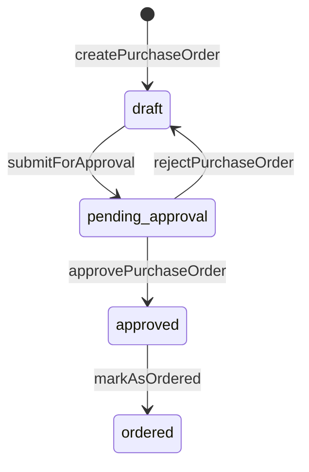

# 10 — Purchase order approval workflow (submit → approve/reject → ordered)

**Status:** COMPLETE  
**Series order:** 10 (see [README](./README.md))  
**Last updated:** 2026-03-26  
**Standard:** [TRACE-STANDARD.md](./TRACE-STANDARD.md)

## 0. Capability & scope

**User capability:** Move a purchase order through **draft → pending approval → approved** (or **back to draft** on rejection), then **approved → ordered** when sent to the supplier.

**In scope:** `submitForApproval`, `approvePurchaseOrder`, `rejectPurchaseOrder`, `markAsOrdered` in [`purchase-orders.ts`](../../src/server/functions/suppliers/purchase-orders.ts); matching hooks in [`use-purchase-orders.ts`](../../src/hooks/suppliers/use-purchase-orders.ts).

**Out of scope:** PO create ([09](./09-purchase-order-create.md)), receive goods ([02](./02-inventory-stock-in.md)), cancel/close/delete, multi-level `approvePurchaseOrderAtLevel` ([`use-approvals.ts`](../../src/hooks/suppliers/use-approvals.ts) — separate trace).

---

## 1. Trust boundary

| Concern | Source of truth |
|---------|-----------------|
| `organizationId`, actor ids | Server session; each handler filters PO by org + `deletedAt IS NULL` |
| Target PO `id` | Client UUID |
| Status transitions | **Enforced in SQL `WHERE`** (status must match expected step) — not a separate policy module in these four fns |
| `approvalNotes` / rejection reason | Client strings written to DB |
| `supplierReference` (ordered step) | Optional client string on `markAsOrdered` |

---

## 2. State machine (as implemented)



**Note:** `rejectPurchaseOrder` returns status to **`draft`** for revision (not `cancelled`). Copy in handler: “Return to draft for revision” (~L1058).

---

## 3. Entry points

| Step | Server fn | Permission | Input (validator) |
|------|-----------|------------|-------------------|
| Submit | `submitForApproval` | `PERMISSIONS.suppliers.update` | `getPurchaseOrderSchema` → `{ id }` |
| Approve | `approvePurchaseOrder` | `PERMISSIONS.suppliers.approve` | `{ id, notes? }` |
| Reject | `rejectPurchaseOrder` | `PERMISSIONS.suppliers.approve` | `{ id, reason }` (reason required) |
| Mark ordered | `markAsOrdered` | `PERMISSIONS.suppliers.update` | `{ id, supplierReference? }` |

**Discovery:**

```bash
rg -n "useSubmitForApproval|useApprovePurchaseOrder|useRejectPurchaseOrder|useMarkAsOrdered" src/
```

**UI:** PO detail / approval surfaces (grep route `purchase-orders` and components importing the hooks above).

---

## 4. Sequence (per operation)

Each operation follows the same skeleton:

1. `withAuth({ permission: … })`
2. Load existing PO (join supplier for logging metadata) with **status predicate** in `WHERE`
3. If no row → `NotFoundError` with combined message (e.g. “not found or not in draft status”)
4. `update(purchaseOrders).set(…).returning()`
5. `logger.logAsync` activity (`purchase_order`, action `updated`)

**Transactions:** None of these four wrap the update in `db.transaction` — single `update` statement each. Low risk unless future triggers expect atomic multi-table side effects.

---

## 5. Persistence & side effects

| Fn | DB change | Other |
|----|-----------|--------|
| `submitForApproval` | `status: 'pending_approval'` | Activity log |
| `approvePurchaseOrder` | `status: 'approved'`, `approvedBy`, `approvedAt`, `approvalNotes` | Activity log |
| `rejectPurchaseOrder` | `status: 'draft'`, `approvalNotes: 'Rejected: …'` | Activity log |
| `markAsOrdered` | `status: 'ordered'`, `orderedBy`, `orderedAt`, `supplierReference` | Activity log |

No search outbox or supplier notification in these handlers.

---

## 6. Failure matrix

| Condition | Error | User-visible |
|-----------|-------|--------------|
| Wrong status for step | `NotFoundError` (worded as not found **or** wrong status) | Often generic “not found” UX — **support friction** |
| Zod reject | Validation | Form / toast |
| Approve/reject without `suppliers.approve` | `PermissionDeniedError` | Standard |
| Submit/ordered without `suppliers.update` | Same | Standard |

---

## 7. Cache & read-after-write

Workflow hooks invalidate:

- `queryKeys.suppliers.purchaseOrdersList()`, `purchaseOrderStatusCounts()`, `purchaseOrderDetail(id)`
- Submit/approve/reject also hit `purchaseOrdersPendingApprovals()`
- `useMarkAsOrdered` additionally invalidates `queryKeys.suppliers.suppliersList()`

---

## 8. Drift & technical debt

| Issue | Evidence | Risk |
|-------|----------|------|
| **Permission asymmetry** | Submit/ordered use `suppliers.update`; approve/reject use `suppliers.approve` | Correct for segregation of duties, but UI must hide buttons per role |
| **NotFoundError masks wrong status** | Same error type/message bucket for missing id vs wrong status | Harder debugging and worse client error mapping |
| **No optimistic locking** | Updates do not check `version` column | Concurrent edits could stomp (if PO gains concurrent edits later) |
| **Reject from `pending_approval` only** | `approvedBy` typically unset | Stale `approved*` columns unlikely on this path; still worth UI showing only fields relevant to status |

---

## 9. Verification

- Search `submitForApproval`, `approvePurchaseOrder`, `rejectPurchaseOrder`, `markAsOrdered` under `tests/`.
- **Gap:** Transition matrix test (each illegal edge returns expected error); RBAC matrix test for update vs approve.

---

## 10. Follow-up traces

- `cancelPurchaseOrder` / `closePurchaseOrder` and receiving (`receiveGoods`).
- Multi-level approval (`approvePurchaseOrderAtLevel`) vs simple approve.
