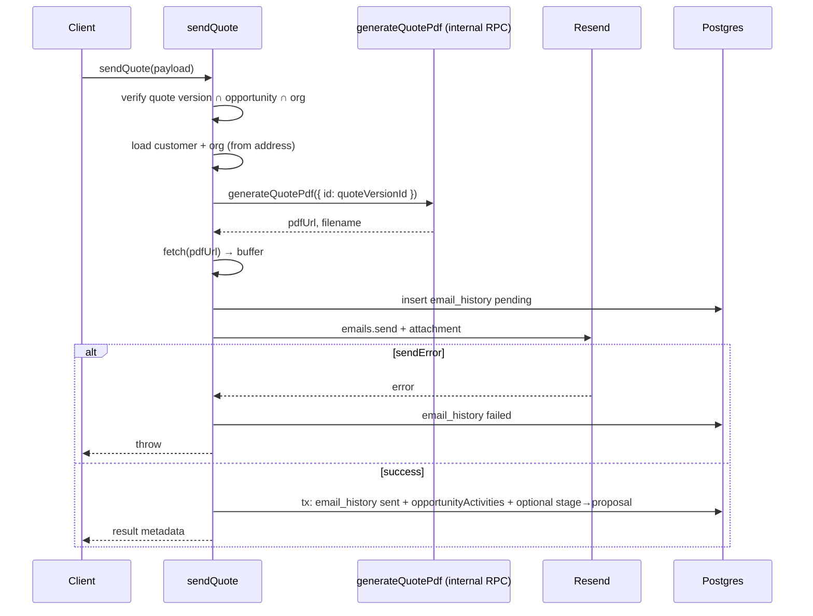

# 11 — Quote PDF generation & send (email)

**Status:** COMPLETE  
**Series order:** 11 (see [README](./README.md))  
**Last updated:** 2026-03-26  
**Standard:** [TRACE-STANDARD.md](./TRACE-STANDARD.md)

## 0. Capability & scope

**User capability:** (A) **Generate** a quote PDF for a `quote_versions` row, store it in object storage, upsert `generated_documents`, and set `opportunities.quotePdfUrl`. (B) **Email** that quote (generating PDF via the same pipeline) with Resend, record `email_history`, log pipeline activity, and optionally advance opportunity **stage** to `proposal`.

**In scope:** `generateQuotePdf`, `sendQuote` in [`quote-versions.tsx`](../../src/server/functions/pipeline/quote-versions.tsx); hooks [`useGenerateQuotePdf`](../../src/hooks/pipeline/use-quote-mutations.ts), [`useSendQuote`](../../src/hooks/pipeline/use-quote-mutations.ts); schemas `quoteVersionParamsSchema`, `sendQuoteSchema` ([`pipeline.ts`](../../src/lib/schemas/pipeline/pipeline.ts)).

**Out of scope:** `createQuoteVersion` ([08](./08-quote-version-create.md)), compare versions, extend validity, order conversion.

---

## 1. Trust boundary

| Concern | Source of truth |
|---------|-----------------|
| `quoteVersionId` / `opportunityId` | Client UUIDs; `sendQuote` **requires** version row to match opportunity + org |
| Recipient email / CC | Client-supplied; used as Resend `to` / `cc` |
| PDF bytes | **Server-rendered** (`renderPdfToBuffer` + `QuotePdfDocument`); not client-uploaded |
| Line money in PDF | Built from DB `quote_versions` JSON (`items`) with **legacy cents vs dollars** branching in mapper |
| Storage path / signed URL | Server (`generateStoragePath`, Supabase admin client, long-lived signed URL) |

**Secrets:** `RESEND_API_KEY`, `EMAIL_FROM`, Supabase service role for storage upload (admin client).

---

## 2. Part A — `generateQuotePdf`

### Entry & auth

- `createServerFn` + `.inputValidator(quoteVersionParamsSchema)` → `{ id }` (quote version id).
- `withAuth({ permission: PERMISSIONS.opportunity?.read ?? 'opportunity:read' })` — **read** permission can generate a customer-facing PDF.

### Hop sequence (abbreviated)

1. Load `quote_versions` row by `id` + org.
2. Load `opportunities` by `quoteVersion.opportunityId`.
3. Load `customers`, org branding (`fetchOrganizationForDocument`).
4. Resolve **billing** address: primary billing, else any primary address (~L558–600).
5. Build `QuoteDocumentData` (document number derived from opportunity title slice + version — **not** a stable business quote number).
6. `renderPdfToBuffer` → upload to bucket `documents` via **admin** Supabase (`upsert: true`).
7. `createSignedUrl` (1 year TTL).
8. Upsert `generated_documents` on conflict `(org, entityType, entityId, documentType)`; bump `regenerationCount`.
9. `activityLogger.logAsync` on opportunity (`exported`).
10. `update(opportunities).set({ quotePdfUrl })` — **separate** `db` call after main logic (not in same transaction as storage upload).

### Failure modes

- Missing version / opportunity / customer → `NotFoundError`.
- Upload or signed URL failure → thrown `Error` strings.
- Regeneration overwrites prior storage object + DB row per upsert semantics.

---

## 3. Part B — `sendQuote`

### Entry & auth

- `.inputValidator(sendQuoteSchema)` — `sendQuoteSchema` in [`pipeline.ts`](../../src/lib/schemas/pipeline/pipeline.ts) ~L371.
- `withAuth({ permission: PERMISSIONS.opportunity?.update ?? 'opportunity:update' })` — **stricter than PDF read**; sending is an update action.

### Sequence

**Critical coupling:** `sendQuote` **calls** `generateQuotePdf` as a function (~L905). That runs the full PDF pipeline (storage, `generated_documents`, `quotePdfUrl` update) before email send.

**Post-send transaction** (~L1006–1043):

- Update `email_history` to `sent` + `resendMessageId`.
- Insert `opportunityActivities` type `email`.
- If `opp.stage` is `new` or `qualified`, `update opportunities` to `proposal` with **optimistic predicate** `eq(opportunities.stage, opp.stage)` so concurrent stage changes are not blindly overwritten.

### Failure modes

- PDF generation or download failure → throw before send.
- Resend error → `email_history` marked `failed`, then throw.
- HTML body hardcodes “GST (10%)” in template (~L936–938) — must stay aligned with `GST_RATE` / quote totals logic.

---

## 4. Contracts

| Symbol | Role | File |
|--------|------|------|
| `quoteVersionParamsSchema` | PDF input `{ id }` | [`pipeline.ts`](../../src/lib/schemas/pipeline/pipeline.ts) (re-exported via `@/lib/schemas`) |
| `sendQuoteSchema` | Email send input | same |
| `QuoteLineItem` / stored JSON | Line shape for PDF mapping | Version row `items` column |

---

## 5. Cache & read-after-write

- **`useGenerateQuotePdf`:** no `onSuccess` cache updates in hook — callers must refetch opportunity / documents if needed.
- **`useSendQuote`:** `onSuccess` invalidates `queryKeys.pipeline.quoteVersions(opportunityId)` **only** — does **not** invalidate `pipeline.opportunity(opportunityId)` or opportunity lists despite DB stage/PDF URL changes → **stale UI window** until other queries refetch.

---

## 6. Drift & technical debt

| Issue | Evidence | Risk |
|-------|----------|------|
| Mid-file `import` | `emailHistory` import ~L789 after `generateQuotePdf` handler | Unusual ordering; easy to miss when refactoring |
| `quotePdfUrl` update outside tx | PDF path updates opportunity row separately from `generated_documents` upsert | Partial visibility if one step fails mid-flight |
| Permission split | PDF = read, send = update | Correct principle; document for support |
| Hook cache gap | `useSendQuote` omits opportunity invalidation | Stage and PDF URL not reflected immediately |
| Document number in PDF | `Q-${title.slice(0,20)}-V{n}` | Collision / instability if titles change |

---

## 7. Verification

- Search `generateQuotePdf`, `sendQuote`, `useSendQuote` under `tests/`.
- **Gap:** Integration test with mocked Resend + storage; assert `sendQuote` transaction rolls back email “sent” state if activity insert fails; contract test that hook invalidates opportunity after send.

---

## 8. Follow-up traces

- Quote “sent” flag / versioning if product adds explicit sent state (currently inferred from activity + invalidations).
- Trigger.dev or queue-based email retry if Resend fails transiently.
