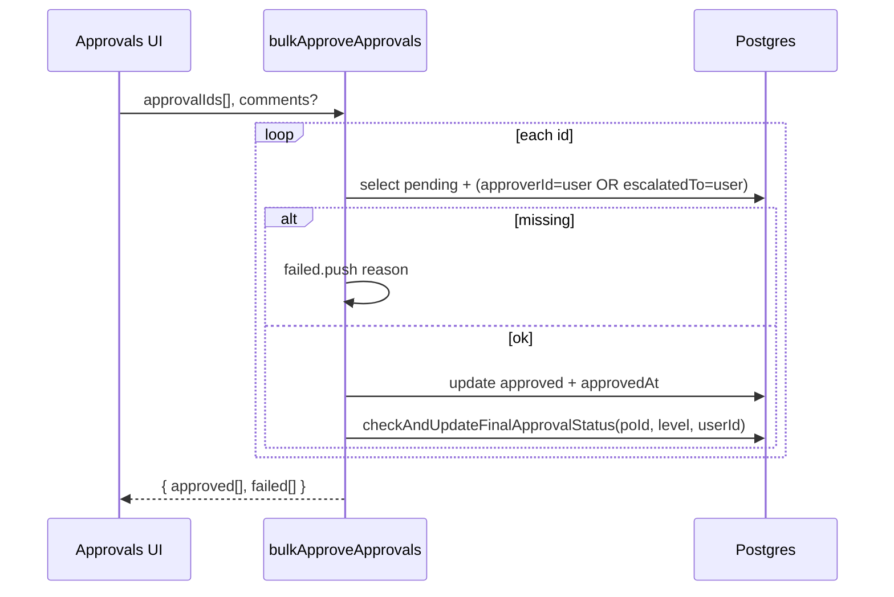

# 17 — PO approval: escalate, delegate, revoke, bulk approve

**Status:** COMPLETE  
**Series order:** 17 (see [README](./README.md))  
**Last updated:** 2026-03-26  
**Standard:** [TRACE-STANDARD.md](./TRACE-STANDARD.md)

## 0. Capability & scope

**User capability:** Manipulate **multi-level** `purchase_order_approvals` rows: **escalate** to another user, **delegate** reassignment (original approver → delegate), **revoke** delegation, **bulk approve** many approval ids in one call, and **resolve approval IDs** from PO ids for list-driven bulk UX.

**In scope:** `escalateApproval`, `delegateApproval`, `revokeDelegation`, `bulkApproveApprovals`, `getApprovalIdsForPurchaseOrders` in [`approvals.ts`](../../src/server/functions/suppliers/approvals.ts); Zod in [`lib/schemas/approvals/index.ts`](../../src/lib/schemas/approvals/index.ts); hooks in [`use-approvals.ts`](../../src/hooks/suppliers/use-approvals.ts).

**Out of scope:** `evaluateApprovalRules`, per-level approve/reject ([16](./16-purchase-order-multi-level-approval.md)); simple PO approve without approval rows ([10](./10-purchase-order-approval-workflow.md)).

---

## 1. Trust boundary

| Concern | Source of truth |
|---------|-----------------|
| `approvalId` | Client UUID; row must match org |
| Escalation target | `validateApprover(escalateTo, org)` — active user in org |
| Delegate target | `validateApprover` implied only for escalate; **delegate** does not call `validateApprover` on `delegateTo` in handler — **gap** (invalid uuid could FK-fail) |
| Authorization | `verifyApproverAuthorization` only on **single** approve/reject ([16](./16-purchase-order-multi-level-approval.md)); **bulk** inlines same OR (`approverId` \| `escalatedTo`) |
| Delegate | Caller must be **current** `approverId` (`eq approverId, ctx.user.id`) |

---

## 2. Operations summary

| Fn | Permission | Status predicate | Main effect |
|----|------------|------------------|-------------|
| `getApprovalIdsForPurchaseOrders` | `suppliers.approve` | `pending` | Returns ids for current user (approver or escalatedTo) for given PO ids |
| `bulkApproveApprovals` | `suppliers.approve` | `pending` + user match | Approve each; `checkAndUpdateFinalApprovalStatus` per row |
| `escalateApproval` | `suppliers.approve` | `pending` | Sets `status: escalated`, `escalatedTo`, `escalationReason`, timestamps |
| `delegateApproval` | `suppliers.approve` | `pending` + user is approver | `approverId := delegateTo`, `delegatedFrom := ctx.user.id` |
| `revokeDelegation` | `suppliers.approve` | `pending` + `delegatedFrom` set | Revert `approverId` to `delegatedFrom`, clear `delegatedFrom` |

---

## 3. Critical workflow inconsistency (escalation vs approve)

- **`approvePurchaseOrderAtLevel`** and **`bulkApproveApprovals`** load approvals with `eq(purchaseOrderApprovals.status, APPROVAL_STATUS.PENDING)` (~L633, ~L776).
- **`escalateApproval`** sets `status: APPROVAL_STATUS.ESCALATED` (~L856).

**Result:** After escalation, the row is **no longer `pending`**, so **standard approve paths will not find it** (“Approval not found or already processed”). The escalation target is named in `escalatedTo`, but the approve query does not allow `escalated` status.

**Audit conclusion:** Either escalation is **dead code / broken**, or a missing code path should treat `escalated` like `pending` for the `escalatedTo` user. **Delegate** keeps `pending` — delegation remains compatible with approve.

---

## 4. Sequence — bulk approve

**Partial success:** Per-id try/catch; failures collected without aborting entire batch.

---

## 5. Persistence & side effects

- **Bulk / single approve:** Same as trace 16 — may set PO `approved` when last pending level completes.
- **Escalate:** Only `purchase_order_approvals` row updated; PO status unchanged.
- **Delegate / revoke:** Only approval row; PO unchanged.

No activity logger calls in these handlers (contrast PO write fns).

---

## 6. Failure matrix

| Condition | Outcome |
|-----------|---------|
| Approval not found / wrong status | `NotFoundError` (escalate/delegate/revoke) or bulk `failed[]` |
| Revoke without delegation | `AuthError` |
| Revoke unauthorized user | `AuthError` |
| Bulk: not authorized for row | `failed` entry “Not found or not authorized” |
| Delegate: not assigned approver | `NotFoundError` wording |

---

## 7. Cache & read-after-write

[`use-approvals.ts`](../../src/hooks/suppliers/use-approvals.ts): bulk/escalate/delegate/revoke invalidate pending lists, PO detail, stats — confirm exact keys when changing UI.

---

## 8. Drift & technical debt

| Issue | Risk |
|-------|------|
| **Escalated state blocks approve** | Escalation workflow unusable with current approve queries |
| **No `validateApprover` on delegate** | Inactive or wrong-org user id may error at DB layer |
| **Bulk approve duplicates logic** | Divergence risk vs `approvePurchaseOrderAtLevel` |
| **Comments shared across bulk** | Same `comments` string applied to every approval in batch |

---

## 9. Verification

- Search `escalateApproval`, `delegateApproval`, `bulkApproveApprovals` under `tests/`.
- **Gap:** Integration: escalate → assert escalatee can approve **or** document bug; delegate → approve; bulk partial failure shape.

---

## 10. Follow-up traces

- Product decision: fix approve to accept `escalated` + `escalatedTo`, or stop setting status to `escalated` and only set `escalatedTo` while keeping `pending`.
- Full webhook / payment path: `handleXeroPaymentUpdate` in [`xero-invoice-sync.ts`](../../src/server/functions/financial/xero-invoice-sync.ts) (separate trace).
