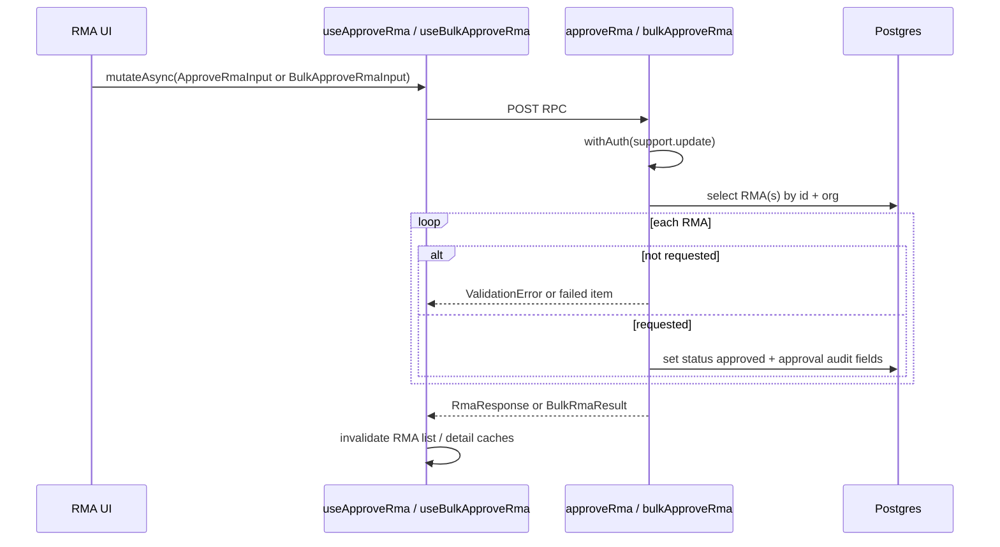

# 21 — RMA approval workflow

**Status:** COMPLETE
**Series order:** 21 (see [README](./README.md))
**Last updated:** 2026-05-04
**Standard:** [TRACE-STANDARD.md](./TRACE-STANDARD.md)

## 0. Capability & scope

**User capability:** Approve one or many requested RMAs so support can move authorized returns toward inventory receipt.

**In scope:** `approveRma` and `bulkApproveRma` ([`orders/rma.ts`](../../src/server/functions/orders/rma.ts)); `approveRmaSchema` and `bulkApproveRmaSchema` ([`lib/schemas/support/rma.ts`](../../src/lib/schemas/support/rma.ts)); [`useApproveRma`](../../src/hooks/support/use-rma.ts), [`useBulkApproveRma`](../../src/hooks/support/use-rma.ts); [`rmas-list-container.tsx`](../../src/components/domain/support/rma/rmas-list-container.tsx) for bulk approval.

**Out of scope:** RMA creation, rejection, receive-to-inventory, remedy execution, role-definition changes, and bulk-list UI redesign.

---

## 1. Trust boundary

| Concern | Source of truth |
|---------|-----------------|
| Tenant / organization | `withAuth({ permission: PERMISSIONS.support.update })` and org-scoped RMA selects |
| Single target | Client `rmaId`; must exist in org |
| Bulk targets | Client `rmaIds`; max 50; each selected by id + organization |
| Transition | `isValidRmaTransition(status, 'approved')`; only requested RMAs approve |
| Approval audit | Server stamps `approvedAt`, `approvedBy`, `updatedBy` |
| Notes | Optional client notes appended to `internalNotes` with `[Approval]` prefix |

**AuthZ:** single and bulk approval both require `PERMISSIONS.support.update`.

---

## 2. Entry points

**Discovery:**

```bash
rg -n "useApproveRma|useBulkApproveRma|approveRma|bulkApproveRma" src/
```

| Surface | Path | Trigger |
|---------|------|---------|
| RMA detail actions | `useApproveRma` consumers | Approve one requested RMA |
| RMA list bulk bar | `src/components/domain/support/rma/rmas-list-container.tsx` | Select requested RMAs and click bulk approve |

---

## 3. Sequence



---

## 4. Contracts

| Layer | Symbol | File |
|-------|--------|------|
| Single input | `approveRmaSchema` | [`lib/schemas/support/rma.ts`](../../src/lib/schemas/support/rma.ts) |
| Bulk input | `bulkApproveRmaSchema` | [`lib/schemas/support/rma.ts`](../../src/lib/schemas/support/rma.ts) |
| Server single | `.inputValidator(approveRmaSchema)` | [`orders/rma.ts`](../../src/server/functions/orders/rma.ts) |
| Server bulk | `.inputValidator(bulkApproveRmaSchema)` | [`orders/rma.ts`](../../src/server/functions/orders/rma.ts) |
| Hook single | `useApproveRma` | [`hooks/support/use-rma.ts`](../../src/hooks/support/use-rma.ts) |
| Hook bulk | `useBulkApproveRma` | [`hooks/support/use-rma.ts`](../../src/hooks/support/use-rma.ts) |

---

## 5. Persistence & side effects

| Path | Persistence | Transaction |
|------|-------------|-------------|
| Single approve | Updates one `return_authorizations` row to `approved` | No explicit transaction |
| Bulk approve | Updates valid requested RMAs to `approved`; reports per-id failures | One transaction for valid updates, with org RLS config |

No inventory movement happens here. Inventory restoration belongs to `receiveRma` / `bulkReceiveRma` ([13](./13-rma-receive-inventory.md)).

---

## 6. Failure matrix

| Condition | Single approve | Bulk approve |
|-----------|----------------|--------------|
| RMA missing | `NotFoundError` | Failed item: `RMA not found` |
| Status not requested | `ValidationError` | Failed item with current status |
| Zod invalid payload | Validation error | Validation error |
| Permission missing | Auth/permission error | Auth/permission error |

---

## 7. Cache & read-after-write

- `useApproveRma`: invalidates `queryKeys.support.rmasList()`, `queryKeys.support.rmaDetail(result.id)`, and `queryKeys.orders.detail(result.orderId)`.
- `useBulkApproveRma`: invalidates `queryKeys.support.rmasList()` and `queryKeys.support.rmaDetails()`.

Bulk approval does not return individual updated RMA rows, so it invalidates list/detail families instead of setting detail data.

---

## 8. Drift & technical debt

| Issue | Risk |
|-------|------|
| Single approve has no explicit transaction | Low for one-row state update, but audit updates are not wrapped with read |
| Bulk result omits updated ids | UI cannot update exact detail caches without broad invalidation |
| Bulk approval has no order detail invalidation | Order detail may require refresh if approval status is rendered there |

---

## 9. Verification

- **Guard:** `tests/unit/support/rma-approval-permission-contract.test.ts` verifies single and bulk approval both require `PERMISSIONS.support.update`.
- **Guard:** `tests/unit/support/rma-approval-permission-contract.test.ts` verifies this trace records the permission and cache contract.
- **Gap:** DB-backed integration for mixed requested/non-requested bulk batches.
