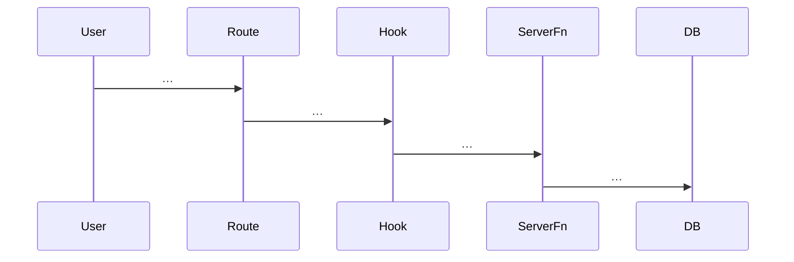

# Trace: &lt;Workflow title&gt;

**Status:** DRAFT | COMPLETE | REVIEWED  
**Last updated:** YYYY-MM-DD  
**Owner:** …

## 0. Capability & scope

**User capability (one verb):** …

**In scope:** …

**Out of scope:** …

---

## 1. Trust boundary

| Concern | Source of truth |
|---------|-----------------|
| Organization / tenant | Server (`withAuth`, session) |
| Payload fields | … |
| Idempotency | … / none |

---

## 2. Entry points (exhaustive)

| Surface | Path | Trigger |
|---------|------|---------|
| … | `src/…` | … |

**Discovery:** `rg -n "<symbol>" src/` …

---

## 3. Sequence (call graph or diagram)

---

## 4. Contracts

| Layer | Symbol | File |
|-------|--------|------|
| Canonical input | `…Schema` | `src/lib/schemas/…` |
| Server gate | `.inputValidator(…)` | `src/server/functions/…` |
| UI / wizard | `…Schema` | … |

**Normalization:** `…` (function) — what it strips/coerces.

---

## 5. AuthZ

- Permission: `PERMISSIONS.…`
- Alternative roles / feature flags: …

---

## 6. Persistence & side effects

| Step | Stores / queues | Transaction |
|------|-----------------|-------------|
| … | … | single / per-item / none |

---

## 7. Failure matrix

| Condition | HTTP / error type | User sees | Code path |
|-----------|---------------------|-----------|-----------|
| … | … | … | `file:handler` |

---

## 8. Cache & read-after-write

- Invalidations: …
- Stale risk: …

---

## 9. Drift & technical debt

| Issue | Evidence | Risk |
|-------|----------|------|
| Duplicate Zod | `schemaA` vs `schemaB` | … |

---

## 10. Verification

- Tests: …
- Gaps: …

---

## 11. Follow-up traces

- …
