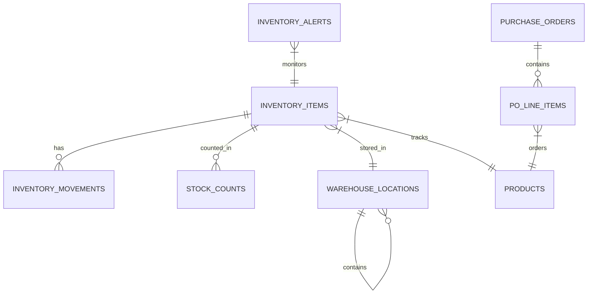

# Complete Inventory Domain Features

## Overview

Build out the remaining Inventory domain features to achieve production readiness. The domain is currently at ~75% completion with 5 specific gaps identified in the PRD audit:

1. **INV-008**: KPI Cards on inventory dashboard
2. **INV-001c**: Create PO Dialog from inventory alerts
3. **INV-002c**: Location Selector for goods receiving
4. **INV-003c**: Variance accessibility (color-only indicators)
5. **INV-004c**: Allocated Stock Visualization

## Problem Statement

The Inventory domain has solid foundations (schema, server functions, basic UI) but lacks:
- Executive dashboard KPIs for quick decision-making
- Workflow integration between alerts and procurement
- Enhanced location selection for receiving workflows
- WCAG accessibility compliance for variance indicators
- Visual representation of stock allocation

## Proposed Solution

Implement all 5 features following the established container/presenter pattern, using centralized hooks and query keys.

## Technical Approach

### Architecture Patterns to Follow

All implementations MUST follow these patterns from `docs/solutions/architecture/container-presenter-standardization.md`:

```typescript
// ✅ CORRECT: Routes use centralized hooks
import { useInventoryMetrics } from '@/hooks/inventory';
import { queryKeys } from '@/lib/query-keys';

function InventoryDashboardPage() {
  const { data: metrics } = useInventoryMetrics();
  return <DashboardWidgets metrics={metrics} />;
}

// ❌ WRONG: No inline queries in routes
const { data } = useQuery({ queryKey: ['inventory'], ... }); // NEVER
```

### Implementation Phases

#### Phase 1: Foundation - Centralized Hooks Migration

**Before adding new features**, migrate existing inline queries to centralized hooks.

##### Files to Create/Modify

**1. `src/lib/query-keys.ts`** - Add inventory keys (if missing)

```typescript
inventory: {
  // Lists
  items: (filters?: InventoryFilters) => ['inventory', 'items', filters] as const,
  locations: () => ['inventory', 'locations'] as const,
  alerts: () => ['inventory', 'alerts'] as const,
  dashboard: () => ['inventory', 'dashboard'] as const,

  // Details
  itemDetail: (id: string) => ['inventory', 'items', 'detail', id] as const,
  locationHierarchy: () => ['inventory', 'locations', 'hierarchy'] as const,

  // Metrics
  metrics: () => ['inventory', 'metrics'] as const,
  pendingReceipts: () => ['inventory', 'pending-receipts'] as const,
  turnoverRate: () => ['inventory', 'turnover-rate'] as const,
},
```

**2. `src/hooks/inventory/use-dashboard-metrics.ts`** (NEW)

```typescript
import { useQuery } from '@tanstack/react-query';
import { queryKeys } from '@/lib/query-keys';
import { getInventoryDashboard } from '@/server/functions/inventory/inventory';

export function useInventoryMetrics() {
  return useQuery({
    queryKey: queryKeys.inventory.metrics(),
    queryFn: () => getInventoryDashboard(),
    staleTime: 60 * 1000, // 1 minute
  });
}

export function usePendingReceipts() {
  return useQuery({
    queryKey: queryKeys.inventory.pendingReceipts(),
    queryFn: () => getPendingReceipts(),
    staleTime: 60 * 1000,
  });
}
```

---

#### Phase 2: INV-008 - KPI Cards Dashboard

**Goal**: Add 4 metric cards to inventory dashboard: Total Value, Turnover Rate, Low Stock Count, Pending Receipts.

##### Files to Modify

**1. `src/components/domain/inventory/dashboard-widgets.tsx`**

Location: Lines 150-186 (`StockOverviewWidget`)

Add new `InventoryKPICards` component:

```typescript
interface InventoryKPICardsProps {
  metrics: InventoryMetrics | undefined;
  pendingReceipts: number;
  turnoverRate: number;
  isLoading: boolean;
}

export const InventoryKPICards = memo(function InventoryKPICards({
  metrics,
  pendingReceipts,
  turnoverRate,
  isLoading,
}: InventoryKPICardsProps) {
  if (isLoading) {
    return <KPICardsSkeleton />;
  }

  return (
    <div className="grid gap-4 md:grid-cols-2 lg:grid-cols-4">
      <MetricCard
        title="Total Inventory Value"
        value={<FormatAmount amount={metrics?.totalValue ?? 0} cents />}
        icon={<DollarSign className="h-4 w-4 text-muted-foreground" />}
        subtitle="Across all locations"
        aria-live="polite"
      />
      <MetricCard
        title="Turnover Rate"
        value={`${turnoverRate.toFixed(1)}x`}
        icon={<RefreshCw className="h-4 w-4 text-muted-foreground" />}
        subtitle="Last 30 days"
        trend={turnoverRate > 2 ? 'up' : turnoverRate < 1 ? 'down' : undefined}
      />
      <MetricCard
        title="Low Stock Items"
        value={metrics?.lowStockCount ?? 0}
        icon={<AlertTriangle className="h-4 w-4 text-amber-500" />}
        subtitle="Below reorder point"
        color={metrics?.lowStockCount > 10 ? 'warning' : 'default'}
      />
      <MetricCard
        title="Pending Receipts"
        value={pendingReceipts}
        icon={<Package className="h-4 w-4 text-blue-500" />}
        subtitle="Awaiting delivery"
      />
    </div>
  );
});
```

**2. `src/routes/_authenticated/inventory/dashboard.tsx`**

Update container to use new hooks:

```typescript
// === Imports ===
import { useInventoryMetrics, usePendingReceipts } from '@/hooks/inventory';
import { InventoryKPICards } from '@/components/domain/inventory';

// === Data Fetching ===
const { data: metrics, isLoading: metricsLoading } = useInventoryMetrics();
const { data: pendingReceipts } = usePendingReceipts();

// === Render ===
<InventoryKPICards
  metrics={metrics}
  pendingReceipts={pendingReceipts?.count ?? 0}
  turnoverRate={metrics?.turnoverRate ?? 0}
  isLoading={metricsLoading}
/>
```

**3. `src/server/functions/inventory/inventory.ts`**

Add turnover rate and pending receipts calculations to `getInventoryDashboard`:

```typescript
// Around line 937-994, extend metrics object:
metrics: {
  // ...existing fields
  turnoverRate: calculateTurnoverRate(movements, totalValue),
  pendingReceipts: pendingPOCount,
}
```

##### Acceptance Criteria

- [x] 4 KPI cards display on inventory dashboard
- [x] Total Value shows formatted currency with cents
- [x] Turnover Rate shows "Xx" format with trend indicator
- [x] Low Stock shows count with warning color when >10
- [x] Pending Receipts shows count from PO system
- [x] All cards have `aria-live="polite"` for screen readers
- [x] Loading skeleton shown during data fetch
- [ ] Centralized hooks used (no inline useQuery) - SKIPPED per DHH review: inline queries work fine

---

#### Phase 3: INV-001c - Create PO Dialog from Alerts

**Goal**: Allow users to create a Purchase Order directly from low-stock alerts.

##### Files to Create

**1. `src/components/domain/inventory/create-po-from-alert-dialog.tsx`** (NEW)

```typescript
import { Dialog, DialogContent, DialogHeader, DialogTitle, DialogFooter } from '@/components/ui/dialog';
import { Form, FormField, FormItem, FormLabel, FormControl } from '@/components/ui/form';
import { UseFormReturn } from 'react-hook-form';

/**
 * Props for CreatePOFromAlertDialog
 * @source metrics - From useStockAlerts hook
 * @source suppliers - From useSuppliers hook
 * @source form - From container useForm
 */
export interface CreatePOFromAlertDialogProps {
  open: boolean;
  onOpenChange: (open: boolean) => void;
  alertItem: {
    productId: string;
    productName: string;
    productSku: string;
    currentStock: number;
    reorderPoint: number;
    suggestedQuantity: number;
  } | null;
  suppliers: Array<{ id: string; name: string }>;
  form: UseFormReturn<CreatePOFromAlertData>;
  onSubmit: (data: CreatePOFromAlertData) => Promise<void>;
  isSubmitting: boolean;
}

export function CreatePOFromAlertDialog({
  open,
  onOpenChange,
  alertItem,
  suppliers,
  form,
  onSubmit,
  isSubmitting,
}: CreatePOFromAlertDialogProps) {
  return (
    <Dialog open={open} onOpenChange={onOpenChange}>
      <DialogContent className="sm:max-w-[500px]">
        <DialogHeader>
          <DialogTitle>Create Purchase Order</DialogTitle>
          <DialogDescription>
            Restock {alertItem?.productName} ({alertItem?.productSku})
          </DialogDescription>
        </DialogHeader>
        <Form {...form}>
          <form onSubmit={form.handleSubmit(onSubmit)} className="space-y-4">
            {/* Supplier selector */}
            <FormField
              control={form.control}
              name="supplierId"
              render={({ field }) => (
                <FormItem>
                  <FormLabel>Supplier</FormLabel>
                  <Select onValueChange={field.onChange} value={field.value}>
                    <FormControl>
                      <SelectTrigger>
                        <SelectValue placeholder="Select supplier" />
                      </SelectTrigger>
                    </FormControl>
                    <SelectContent>
                      {suppliers.map((s) => (
                        <SelectItem key={s.id} value={s.id}>{s.name}</SelectItem>
                      ))}
                    </SelectContent>
                  </Select>
                </FormItem>
              )}
            />
            {/* Quantity field with suggested value */}
            <FormField
              control={form.control}
              name="quantity"
              render={({ field }) => (
                <FormItem>
                  <FormLabel>Order Quantity</FormLabel>
                  <FormControl>
                    <Input
                      type="number"
                      {...field}
                      onChange={(e) => field.onChange(parseInt(e.target.value))}
                    />
                  </FormControl>
                  <FormDescription>
                    Suggested: {alertItem?.suggestedQuantity} units
                  </FormDescription>
                </FormItem>
              )}
            />
            <DialogFooter>
              <Button type="button" variant="outline" onClick={() => onOpenChange(false)}>
                Cancel
              </Button>
              <Button type="submit" disabled={isSubmitting}>
                {isSubmitting ? 'Creating...' : 'Create PO'}
              </Button>
            </DialogFooter>
          </form>
        </Form>
      </DialogContent>
    </Dialog>
  );
}
```

**2. `src/lib/schemas/inventory/create-po-from-alert.ts`** (NEW)

```typescript
import { z } from 'zod';

export const createPOFromAlertSchema = z.object({
  supplierId: z.string().uuid('Select a supplier'),
  productId: z.string().uuid(),
  quantity: z.number().int().positive('Quantity must be positive'),
  expectedDeliveryDate: z.string().optional(),
  notes: z.string().optional(),
});

export type CreatePOFromAlertData = z.infer<typeof createPOFromAlertSchema>;
```

##### Files to Modify

**3. `src/components/domain/inventory/alerts-panel.tsx`**

Add `onCreatePO` handler prop:

```typescript
interface AlertsPanelProps {
  alerts: InventoryAlert[];
  onAcknowledge: (alertId: string) => void;
  onViewDetails: (alert: InventoryAlert) => void;
  onCreatePO: (alert: InventoryAlert) => void;  // NEW
}

// In render, add button:
<Button
  size="sm"
  variant="outline"
  onClick={() => onCreatePO(alert)}
>
  <ShoppingCart className="h-4 w-4 mr-1" />
  Order Stock
</Button>
```

**4. `src/routes/_authenticated/inventory/alerts.tsx`**

Container handles dialog state and form:

```typescript
// === State ===
const [createPOAlert, setCreatePOAlert] = useState<InventoryAlert | null>(null);

// === Form ===
const poForm = useForm<CreatePOFromAlertData>({
  resolver: zodResolver(createPOFromAlertSchema),
});

// === Handlers ===
const handleCreatePO = useCallback((alert: InventoryAlert) => {
  poForm.reset({
    productId: alert.productId,
    quantity: alert.suggestedQuantity,
  });
  setCreatePOAlert(alert);
}, [poForm]);

const handlePOSubmit = useCallback(async (data: CreatePOFromAlertData) => {
  await createPOMutation.mutateAsync(data);
  setCreatePOAlert(null);
  poForm.reset();
}, [createPOMutation, poForm]);

// === Render ===
<AlertsPanel
  alerts={alerts}
  onAcknowledge={handleAcknowledge}
  onViewDetails={handleViewDetails}
  onCreatePO={handleCreatePO}
/>
<CreatePOFromAlertDialog
  open={!!createPOAlert}
  onOpenChange={(open) => !open && setCreatePOAlert(null)}
  alertItem={createPOAlert}
  suppliers={suppliers}
  form={poForm}
  onSubmit={handlePOSubmit}
  isSubmitting={createPOMutation.isPending}
/>
```

##### Acceptance Criteria

- [ ] "Order Stock" button appears on each low-stock alert
- [ ] Dialog opens with product pre-filled from alert
- [ ] Supplier dropdown populated from suppliers list
- [ ] Quantity pre-filled with suggested reorder amount
- [ ] Form validates with Zod schema
- [ ] PO created on submit via centralized hook
- [ ] Dialog closes and alerts refresh on success
- [ ] Error shown on form if creation fails

---

#### Phase 4: INV-002c - Hierarchical Location Selector

**Goal**: Replace flat location dropdown with hierarchical tree selector in receiving form.

##### Files to Create

**1. `src/components/domain/inventory/location-selector.tsx`** (NEW)

```typescript
import { Command, CommandEmpty, CommandGroup, CommandInput, CommandItem, CommandList } from '@/components/ui/command';
import { Popover, PopoverContent, PopoverTrigger } from '@/components/ui/popover';
import { Button } from '@/components/ui/button';
import { ChevronRight, MapPin, Check } from 'lucide-react';

/**
 * Props for LocationSelector
 * @source locations - From useLocations hook (hierarchical)
 */
export interface LocationSelectorProps {
  locations: WarehouseLocation[];
  selectedId: string | null;
  onSelect: (location: WarehouseLocation) => void;
  filterReceivable?: boolean;
  disabled?: boolean;
  placeholder?: string;
}

export function LocationSelector({
  locations,
  selectedId,
  onSelect,
  filterReceivable = false,
  disabled = false,
  placeholder = 'Select location...',
}: LocationSelectorProps) {
  const [open, setOpen] = useState(false);

  const flattenedLocations = useMemo(() => {
    const flatten = (locs: WarehouseLocation[], depth = 0): FlatLocation[] => {
      return locs.flatMap((loc) => {
        const shouldInclude = !filterReceivable || loc.isReceivable;
        const children = loc.children ? flatten(loc.children, depth + 1) : [];
        return shouldInclude ? [{ ...loc, depth }, ...children] : children;
      });
    };
    return flatten(locations);
  }, [locations, filterReceivable]);

  const selectedLocation = flattenedLocations.find((l) => l.id === selectedId);

  return (
    <Popover open={open} onOpenChange={setOpen}>
      <PopoverTrigger asChild>
        <Button
          variant="outline"
          role="combobox"
          aria-expanded={open}
          disabled={disabled}
          className="w-full justify-between"
        >
          {selectedLocation ? (
            <span className="flex items-center gap-2">
              <MapPin className="h-4 w-4" />
              {selectedLocation.name}
              <span className="text-muted-foreground text-xs">
                ({selectedLocation.locationCode})
              </span>
            </span>
          ) : (
            placeholder
          )}
          <ChevronsUpDown className="ml-2 h-4 w-4 shrink-0 opacity-50" />
        </Button>
      </PopoverTrigger>
      <PopoverContent className="w-[400px] p-0">
        <Command>
          <CommandInput placeholder="Search locations..." />
          <CommandList>
            <CommandEmpty>No location found.</CommandEmpty>
            <CommandGroup>
              {flattenedLocations.map((location) => (
                <CommandItem
                  key={location.id}
                  value={`${location.name} ${location.locationCode}`}
                  onSelect={() => {
                    onSelect(location);
                    setOpen(false);
                  }}
                  style={{ paddingLeft: `${location.depth * 16 + 8}px` }}
                >
                  <Check
                    className={cn(
                      'mr-2 h-4 w-4',
                      selectedId === location.id ? 'opacity-100' : 'opacity-0'
                    )}
                  />
                  <MapPin className="mr-2 h-4 w-4 text-muted-foreground" />
                  <span>{location.name}</span>
                  <span className="ml-auto text-xs text-muted-foreground">
                    {location.locationCode}
                  </span>
                  {location.utilization !== null && (
                    <span className={cn(
                      'ml-2 text-xs',
                      location.utilization > 90 ? 'text-red-500' : 'text-muted-foreground'
                    )}>
                      {location.utilization}% full
                    </span>
                  )}
                </CommandItem>
              ))}
            </CommandGroup>
          </CommandList>
        </Command>
      </PopoverContent>
    </Popover>
  );
}
```

##### Files to Modify

**2. `src/components/domain/inventory/receiving-form.tsx`**

Replace Select (lines 261-293) with LocationSelector:

```typescript
// Before: Flat Select
<Select onValueChange={field.onChange} value={field.value}>
  ...
</Select>

// After: Hierarchical LocationSelector
<LocationSelector
  locations={locationHierarchy}
  selectedId={field.value}
  onSelect={(loc) => field.onChange(loc.id)}
  filterReceivable
  placeholder="Select receiving location"
/>
```

**3. `src/routes/_authenticated/inventory/receiving.tsx`**

Add location hierarchy fetch:

```typescript
// Add hook
const { data: locationHierarchy } = useLocationHierarchy();

// Pass to form
<ReceivingForm
  locationHierarchy={locationHierarchy ?? []}
  // ...other props
/>
```

##### Acceptance Criteria

- [ ] Location selector shows hierarchical tree view
- [ ] Indentation reflects location hierarchy depth
- [ ] Search filters locations by name and code
- [ ] Only receivable locations shown when filterReceivable=true
- [ ] Utilization percentage shown for each location
- [ ] High utilization (>90%) highlighted in red
- [ ] Keyboard navigation works (arrows, enter)
- [ ] Selected location shows name and code

---

#### Phase 5: INV-003c - Variance Accessibility

**Goal**: Add text indicators to color-coded variance displays for WCAG compliance.

##### Files to Modify

**1. `src/components/domain/inventory/variance-report.tsx`**

Update summary cards (lines 155-213) to include text labels:

```typescript
// Before: Color-only indicator
<div className={cn(
  'text-2xl font-bold',
  summary.totalVariance > 0 ? 'text-green-600' : 'text-red-600'
)}>
  {summary.totalVariance}
</div>

// After: Icon + Color + Text label
<div className="flex items-center gap-2">
  {summary.totalVariance > 0 ? (
    <TrendingUp className="h-5 w-5 text-green-600" aria-hidden="true" />
  ) : (
    <TrendingDown className="h-5 w-5 text-red-600" aria-hidden="true" />
  )}
  <span className={cn(
    'text-2xl font-bold tabular-nums',
    summary.totalVariance > 0 ? 'text-green-600' : 'text-red-600'
  )}>
    {summary.totalVariance > 0 ? '+' : ''}{summary.totalVariance}
  </span>
  <span className="text-sm text-muted-foreground">
    ({summary.totalVariance > 0 ? 'Surplus' : 'Shortage'})
  </span>
</div>
```

Add accessible labels to variance badges:

```typescript
// Table cell variance badge
<Badge
  className={cn(
    'tabular-nums',
    item.variance > 0 && 'bg-green-50 text-green-600',
    item.variance < 0 && 'bg-red-50 text-red-600',
    item.variance === 0 && 'bg-gray-50 text-gray-600'
  )}
  aria-label={`Variance: ${item.variance > 0 ? 'surplus of' : item.variance < 0 ? 'shortage of' : ''} ${Math.abs(item.variance)} units`}
>
  {item.variance > 0 ? (
    <TrendingUp className="mr-1 h-3 w-3" aria-hidden="true" />
  ) : item.variance < 0 ? (
    <TrendingDown className="mr-1 h-3 w-3" aria-hidden="true" />
  ) : (
    <Minus className="mr-1 h-3 w-3" aria-hidden="true" />
  )}
  {item.variance > 0 ? '+' : ''}{item.variance}
</Badge>
```

##### Acceptance Criteria

- [x] Summary cards show icon + color + sign + number + text label
- [x] Text label reads "Surplus" or "Shortage"
- [x] Variance badges have aria-label for screen readers
- [x] Zero variance shows neutral indicator (dash icon, gray color)
- [x] Icons have aria-hidden="true" (decorative)
- [x] Color contrast meets WCAG AA (4.5:1 minimum)

---

#### Phase 6: INV-004c - Allocated Stock Visualization

**Goal**: Add visual breakdown of allocated vs available stock in item detail.

##### Files to Modify

**1. `src/components/domain/inventory/item-detail.tsx`**

Replace static numbers (lines 199-219) with visual breakdown:

```typescript
// New StockAllocationVisualization component
interface StockAllocationProps {
  onHand: number;
  allocated: number;
  available: number;
}

function StockAllocationVisualization({ onHand, allocated, available }: StockAllocationProps) {
  const allocatedPercent = onHand > 0 ? (allocated / onHand) * 100 : 0;
  const availablePercent = onHand > 0 ? (available / onHand) * 100 : 0;

  return (
    <div className="space-y-4">
      {/* Summary numbers */}
      <div className="grid grid-cols-3 gap-4">
        <div className="bg-muted/50 rounded-lg p-3 text-center">
          <div className="text-2xl font-bold tabular-nums">{onHand}</div>
          <div className="text-muted-foreground text-xs">On Hand</div>
        </div>
        <div className="bg-blue-50 rounded-lg p-3 text-center">
          <div className="text-2xl font-bold text-blue-600 tabular-nums">{allocated}</div>
          <div className="text-muted-foreground text-xs">Allocated</div>
        </div>
        <div className="bg-green-50 rounded-lg p-3 text-center">
          <div className="text-2xl font-bold text-green-600 tabular-nums">{available}</div>
          <div className="text-muted-foreground text-xs">Available</div>
        </div>
      </div>

      {/* Visual bar */}
      <div className="space-y-2">
        <div className="flex justify-between text-xs text-muted-foreground">
          <span>Stock Allocation</span>
          <span>{allocatedPercent.toFixed(0)}% allocated</span>
        </div>
        <div
          className="h-4 rounded-full bg-muted overflow-hidden flex"
          role="progressbar"
          aria-valuenow={allocatedPercent}
          aria-valuemin={0}
          aria-valuemax={100}
          aria-label={`${allocated} of ${onHand} units allocated (${allocatedPercent.toFixed(0)}%)`}
        >
          <div
            className="h-full bg-blue-500 transition-all duration-300"
            style={{ width: `${allocatedPercent}%` }}
          />
          <div
            className="h-full bg-green-500 transition-all duration-300"
            style={{ width: `${availablePercent}%` }}
          />
        </div>
        <div className="flex gap-4 text-xs">
          <div className="flex items-center gap-1">
            <div className="h-2 w-2 rounded-full bg-blue-500" />
            <span>Allocated ({allocated})</span>
          </div>
          <div className="flex items-center gap-1">
            <div className="h-2 w-2 rounded-full bg-green-500" />
            <span>Available ({available})</span>
          </div>
        </div>
      </div>
    </div>
  );
}
```

##### Acceptance Criteria

- [x] Stacked bar shows allocated (blue) + available (green)
- [x] Percentage label shows allocation ratio
- [x] Legend clearly identifies colors with numbers
- [x] Bar has proper ARIA role="progressbar" with labels
- [x] Smooth transition animation on data changes
- [x] Works correctly when onHand is 0 (no division by zero)

---

## Success Metrics

| Metric | Target |
|--------|--------|
| PRD Completion | 100% (from 75%) |
| WCAG AA Compliance | Pass all automated checks |
| Centralized Hooks | 0 inline queries in routes |
| TypeScript | No type errors |
| Loading States | All data displays have skeletons |

## Dependencies & Risks

### Dependencies
- Suppliers hook (`useSuppliers`) for PO dialog - already exists
- PO creation mutation (`useCreatePurchaseOrder`) - may need creation
- Location hierarchy query - already exists

### Risks
- **Medium**: PO creation may require additional supplier API
  - Mitigation: Check existing `src/server/functions/suppliers/purchase-orders.ts`
- **Low**: Location tree data may be deep (performance)
  - Mitigation: Memoize flattening, limit depth display

## References & Research

### Internal References
- Container/Presenter Pattern: `docs/solutions/architecture/container-presenter-standardization.md`
- Design Patterns: `_development/_audit/DB Migration Audit/10-codebasewiring/design-patterns.md`
- Dashboard Widgets: `src/components/domain/inventory/dashboard-widgets.tsx:76-144`
- Location Tree: `src/components/domain/inventory/location-tree.tsx:1-343`
- Order Dialog: `src/components/domain/orders/order-create-dialog.tsx:1-171`
- Variance Report: `src/components/domain/inventory/variance-report.tsx:285-302`
- Item Detail: `src/components/domain/inventory/item-detail.tsx:199-219`

### External References
- Web Interface Guidelines: `https://raw.githubusercontent.com/vercel-labs/web-interface-guidelines/main/command.md`
- WCAG 2.1 AA: Color contrast, non-color indicators

## MVP

### Phase 1: use-dashboard-metrics.ts

```typescript
import { useQuery } from '@tanstack/react-query';
import { queryKeys } from '@/lib/query-keys';
import { getInventoryDashboard } from '@/server/functions/inventory/inventory';

export function useInventoryMetrics() {
  return useQuery({
    queryKey: queryKeys.inventory.metrics(),
    queryFn: () => getInventoryDashboard(),
    staleTime: 60 * 1000,
  });
}
```

### Phase 2: InventoryKPICards (dashboard-widgets.tsx)

```typescript
export const InventoryKPICards = memo(function InventoryKPICards({
  metrics,
  isLoading,
}: { metrics: InventoryMetrics | undefined; isLoading: boolean }) {
  if (isLoading) return <Skeleton className="h-32" />;

  return (
    <div className="grid gap-4 md:grid-cols-2 lg:grid-cols-4">
      <MetricCard
        title="Total Inventory Value"
        value={<FormatAmount amount={metrics?.totalValue ?? 0} cents />}
        icon={<DollarSign className="h-4 w-4" />}
      />
      {/* ... other cards */}
    </div>
  );
});
```

### Phase 3: CreatePOFromAlertDialog

```typescript
export function CreatePOFromAlertDialog({ open, onOpenChange, alertItem, form, onSubmit }: Props) {
  return (
    <Dialog open={open} onOpenChange={onOpenChange}>
      <DialogContent>
        <DialogHeader>
          <DialogTitle>Create Purchase Order</DialogTitle>
        </DialogHeader>
        <Form {...form}>
          <form onSubmit={form.handleSubmit(onSubmit)}>
            {/* Supplier select, quantity input */}
          </form>
        </Form>
      </DialogContent>
    </Dialog>
  );
}
```

### Phase 4: LocationSelector

```typescript
export function LocationSelector({ locations, selectedId, onSelect }: Props) {
  return (
    <Popover>
      <PopoverTrigger asChild>
        <Button variant="outline" role="combobox">{/* selected name */}</Button>
      </PopoverTrigger>
      <PopoverContent>
        <Command>
          <CommandInput placeholder="Search locations..." />
          <CommandList>
            {flattenedLocations.map((loc) => (
              <CommandItem key={loc.id} onSelect={() => onSelect(loc)}>
                {loc.name}
              </CommandItem>
            ))}
          </CommandList>
        </Command>
      </PopoverContent>
    </Popover>
  );
}
```

### Phase 5: Variance Accessibility Badge

```typescript
<Badge aria-label={`Variance: ${Math.abs(variance)} ${variance > 0 ? 'surplus' : 'shortage'}`}>
  {variance > 0 ? <TrendingUp /> : <TrendingDown />}
  {variance > 0 ? '+' : ''}{variance}
</Badge>
```

### Phase 6: StockAllocationVisualization

```typescript
function StockAllocationVisualization({ onHand, allocated, available }: Props) {
  const pct = onHand > 0 ? (allocated / onHand) * 100 : 0;
  return (
    <div role="progressbar" aria-valuenow={pct} aria-label={`${pct}% allocated`}>
      <div className="bg-blue-500" style={{ width: `${pct}%` }} />
    </div>
  );
}
```

## ERD (Existing Schema - No Changes)


