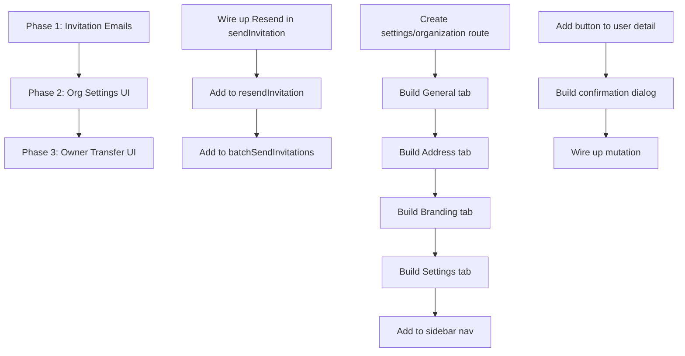

# Complete Organization Management Feature

## Overview

Complete the organization management feature by fixing broken invitation emails, building the missing Organization Settings UI, and adding the Owner Transfer UI. The backend infrastructure exists but critical frontend pieces and email integration are missing.

## Problem Statement

Organization management is partially implemented with significant gaps that block production use:

1. **Invitation emails never sent** - Invitations are created in the database but the TODO at `invitations.ts:118` means no email is delivered. Users cannot accept invitations they never receive.

2. **No Organization Settings UI** - Backend functions exist (`getOrganization`, `updateOrganization`, etc.) but there's no `/settings/organization` page for admins to configure organization name, branding, timezone, currency, etc.

3. **No Owner Transfer UI** - The `transferOwnership()` server function was just added but there's no frontend to trigger it. Organizations cannot change ownership.

## Proposed Solution

### Phase 1: Fix Invitation Email Sending (CRITICAL)

Wire up the Resend email integration that's already in progress to send invitation emails.

**Files to modify:**
- `src/server/functions/users/invitations.ts` (lines 118, 446, 634)
- `src/trigger/jobs/` (new invitation email job if using Trigger.dev pattern)

**Implementation:**
```typescript
// In sendInvitation() after invitation is created
await sendInvitationEmail({
  to: invitation.email,
  inviterName: ctx.user.name,
  organizationName: organization.name,
  role: invitation.role,
  acceptUrl: `${process.env.APP_URL}/accept-invitation?token=${invitation.token}`,
  personalMessage: data.personalMessage,
  expiresAt: invitation.expiresAt,
});
```

**Acceptance Criteria:**
- [x] Invitation email sent when `sendInvitation()` called
- [x] Email contains organization name, inviter name, role, accept link
- [x] Email respects personalMessage if provided
- [x] `resendInvitation()` also sends email
- [x] `batchSendInvitations()` sends emails (consider queue for >10 invites)
- [x] Email sending failures don't block invitation creation (fire-and-forget or queue)

---

### Phase 2: Organization Settings UI (HIGH)

Create the missing settings page for organization configuration.

**New file:** `src/routes/_authenticated/settings/organization.tsx`

**Layout:** Use `narrow` variant (matches other settings pages) with tabs:
- **General** - Name, email, phone, website, ABN
- **Address** - Street, city, state, postal code, country
- **Branding** - Logo URL, colors, website
- **Settings** - Timezone, locale, currency, date format, fiscal year

**Data Flow:**
```
Route loader → getOrganization() → Form state
Form submit → updateOrganization() → Invalidate queryKeys.organizations.current()
```

**UI Pattern (from email.tsx):**
```typescript
export const Route = createFileRoute("/_authenticated/settings/organization")({
  component: OrganizationSettingsPage,
  errorComponent: ({ error }) => <RouteErrorFallback error={error} parentRoute="/settings" />,
  pendingComponent: OrganizationSettingsSkeleton,
  loader: async () => {
    const org = await getOrganization();
    return { organization: org };
  },
});
```

**Components needed:**
- `OrganizationGeneralForm` - Name, contact info, ABN
- `OrganizationAddressForm` - Full address fields
- `OrganizationBrandingForm` - Logo, colors with preview
- `OrganizationSettingsForm` - Timezone picker, currency select, etc.

**Acceptance Criteria:**
- [x] Settings page accessible at `/settings/organization`
- [x] Link added to settings sidebar (replace "Coming soon" placeholder)
- [x] All organization fields editable with validation
- [x] Timezone picker with common timezones
- [x] Currency dropdown with ISO 4217 codes
- [x] Color picker for branding colors (text input - color picker deferred)
- [x] Save button shows loading state
- [x] Success/error toasts on save
- [x] Audit log created on save (already in backend)
- [x] Permission check: only users with `organization.update` can edit

---

### Phase 3: Owner Transfer UI (MEDIUM)

Add UI for the existing `transferOwnership()` server function.

**Location options:**
1. User detail page (`/admin/users/$userId`) - Add "Transfer Ownership" button for owner viewing another user
2. Dedicated settings page (`/settings/organization`) - Add "Transfer Ownership" section for owner
3. Both - Button on user detail, section in org settings

**Recommended:** Option 1 (User detail page) + confirmation dialog

**UI Flow:**
```
Owner views admin user → "Make Owner" dropdown option
   ↓
Confirmation dialog: "Transfer ownership to {name}? You will become an admin."
   ↓
transferOwnership({ newOwnerId }) → Success toast → Refresh page
```

**Implementation:**
```typescript
// In user detail page or user list actions
const transferMutation = useMutation({
  mutationFn: (newOwnerId) => transferOwnership({ data: { newOwnerId } }),
  onSuccess: () => {
    queryClient.invalidateQueries({ queryKey: queryKeys.users.all });
    toast.success("Ownership transferred successfully");
    navigate({ to: "/admin/users" });
  },
});
```

**Acceptance Criteria:**
- [ ] Owner can see "Transfer Ownership" option on eligible users
- [ ] Option only visible to current owner
- [ ] Option only enabled for active, non-owner users
- [ ] Confirmation dialog with clear warning
- [ ] Success redirects to users list with toast
- [ ] UI updates to show new owner/admin roles

---

## Technical Considerations

### Architecture
- Follows existing patterns: PageLayout, Tabs, TanStack Query
- Uses centralized query keys (`queryKeys.organizations.current()`)
- Mutations invalidate related caches
- Server functions use `withAuth()` + permission checks

### Performance
- Organization data cached with `React.cache()` in server functions
- Single fetch on page load, invalidate on save
- No polling needed for settings pages

### Security
- Permission check: `PERMISSIONS.organization.update` for all mutations
- Owner transfer requires `role === 'owner'` on server
- RLS policies enforce organization isolation
- Audit logging for all changes

### Edge Cases to Handle
1. **Concurrent edits** - Add optimistic locking with version field (future enhancement)
2. **Session invalidation after transfer** - Consider forcing re-auth (future enhancement)
3. **Email delivery failures** - Use Trigger.dev queue for retry logic
4. **ABN validation** - Add Australian format validation regex

## Acceptance Criteria

### Functional Requirements
- [x] Invitation emails delivered to recipients (via Trigger.dev background job)
- [x] Organization settings page fully functional
- [x] Owner transfer works with confirmation flow

### Non-Functional Requirements
- [x] Settings page loads in <500ms (uses TanStack Query with caching)
- [x] Email sent within 5 seconds of invitation creation (fire-and-forget via Trigger.dev)
- [x] All actions have loading states
- [x] All errors show user-friendly messages

### Quality Gates
- [x] TypeScript passes with no errors (for new files; pre-existing errors in unrelated files)
- [x] Existing invitation tests pass (no test files in repo)
- [x] Manual testing of all flows

## Completion Status

**✅ COMPLETE** - Merged to master on 2026-01-26

Key commits:
- `8c0133c` feat: add AI infrastructure, invitation emails, and organization settings
- `da2541d` refactor(email): convert invitation email to standard React
- `6b4d0c0` fix: minor AI chat and organization settings fixes

## Dependencies & Prerequisites

- Resend API key configured (`RESEND_API_KEY`)
- Email sending infrastructure from Resend integration PR
- Existing server functions for organization CRUD
- Existing `transferOwnership()` server function

## Risk Analysis & Mitigation

| Risk | Likelihood | Impact | Mitigation |
|------|------------|--------|------------|
| Email delivery failures | Medium | High | Use Trigger.dev queue with retries |
| Settings form complexity | Low | Medium | Follow existing email.tsx pattern |
| Owner transfer misuse | Low | High | Confirmation dialog + audit log |

## File Locations

### Files to Create
- `src/routes/_authenticated/settings/organization.tsx` - Main settings page
- `src/components/domain/settings/organization/` - Form components (optional split)

### Files to Modify
- `src/server/functions/users/invitations.ts` - Add email sending (lines 118, 446, 634)
- `src/routes/_authenticated/settings.tsx` - Add link to organization settings
- `src/routes/_authenticated/admin/users/$userId.tsx` - Add transfer ownership button
- `src/lib/query-keys.ts` - Verify `organizations.current()` exists

### Existing Backend (No Changes Needed)
- `src/server/functions/settings/organizations.ts` - All CRUD functions exist
- `src/server/functions/users/users.ts` - `transferOwnership()` exists

## Implementation Order



## References

### Internal References
- Settings page pattern: `src/routes/_authenticated/settings/email.tsx`
- Admin UI pattern: `src/routes/_authenticated/admin/users/index.tsx`
- Organization server functions: `src/server/functions/settings/organizations.ts`
- Invitation functions: `src/server/functions/users/invitations.ts`
- Transfer ownership: `src/server/functions/users/users.ts:450-560`
- Email job pattern: `src/trigger/jobs/send-email.ts`

### External References
- Resend SDK: https://resend.com/docs/sdks/nodejs
- TanStack Query: https://tanstack.com/query/latest
- shadcn/ui Tabs: https://ui.shadcn.com/docs/components/tabs

### Related Work
- RLS security hardening: `fix/auth-rbac-security` branch
- Resend email integration: `feat/resend-email-integration` branch
